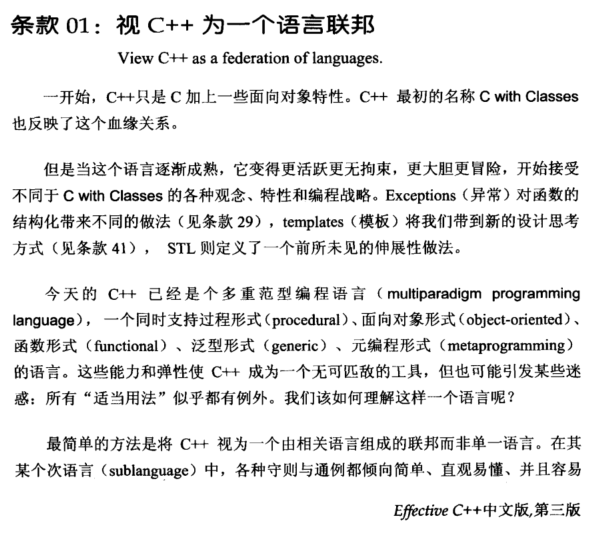
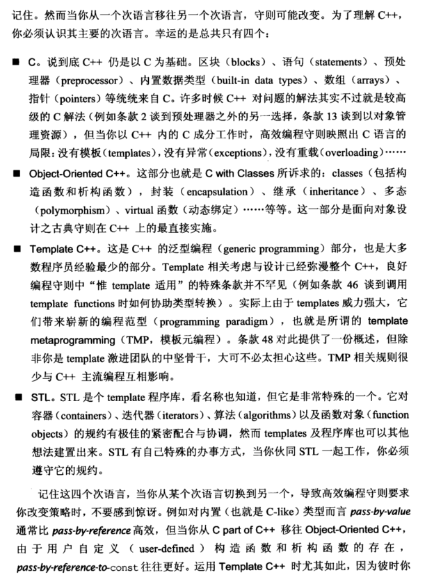
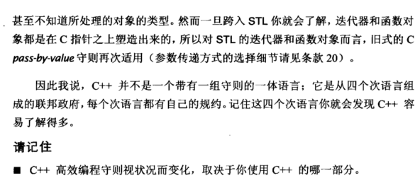

# Note

C++ 是一个多重范型语言（multiparadigm programming）

- 过程形式（procedural）
- 面向对象形式（object-oriented）
- 函数形式（functional）
- 泛型形式（generic）
- 元编程形式（metaprogramming）

C++ 是从四个语言组成的联邦政府，每个语言都有自己的规约

- C：C++以C为基础，当用 C++ 完成 C 成分时，高效编程守则映照出 C 语言的局限。
- Obeject-Oriented C++：在 C 的基础上加上一些面向对象的特性，因此 C++ 最初被称为 C with Classes。
- Template C++：这是 C++ 的泛型编程部分，也是大多数程序员经验最少的部分。
- STL：STL 是个 template 程序库。

因此当这四个子语言相互切换的时候，可以更多地考虑高效编程，例如pass-by-value和pass-by-reference在不同语言中效率不同

总结：

+ C++高效编程守则视状况而变化，取决于使用哪个子语言

# Book

