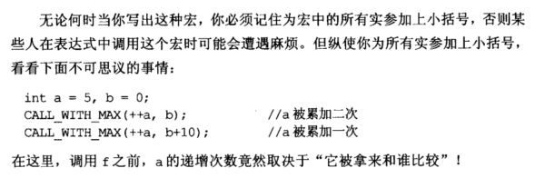
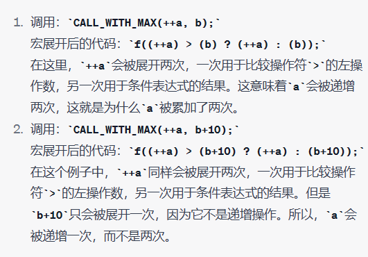
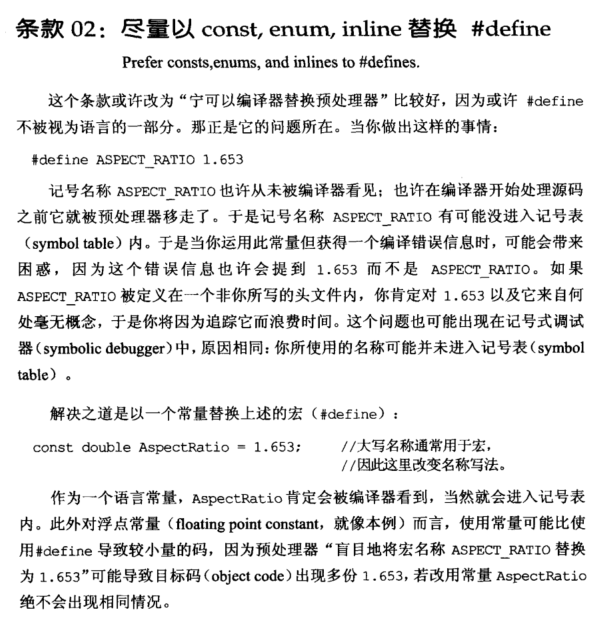
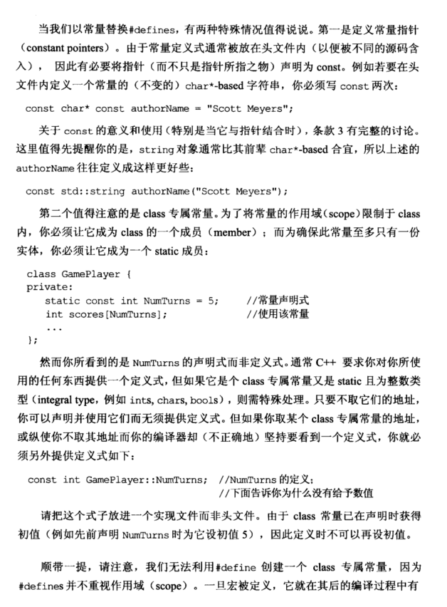
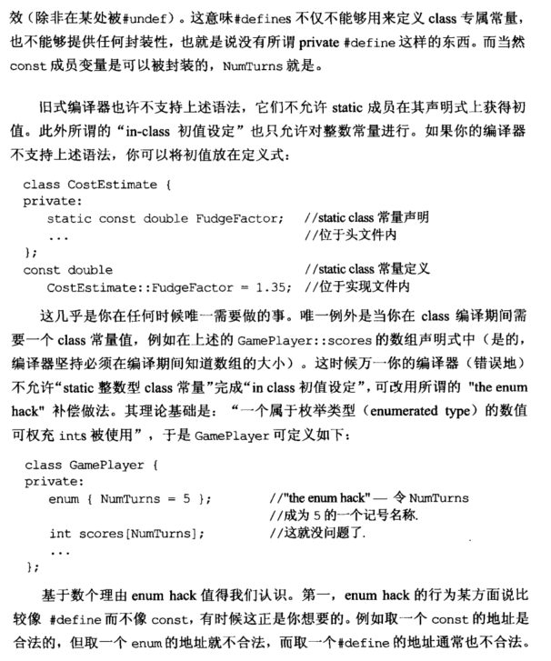
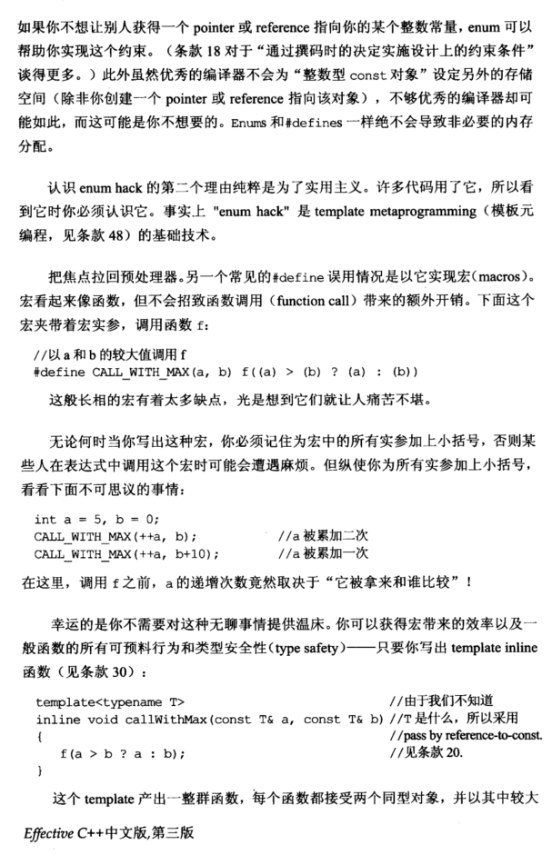
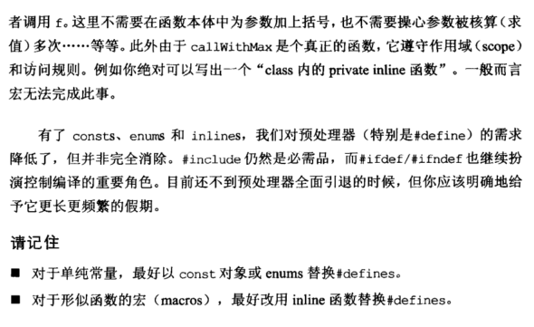

# Note

## other1

### 尽量以const, enum, inline替换#define（Prefer consts,enums, and inlines to #defines)

实际是：应该让编译器代替预处理器定义，因为预处理器定义的变量并没有进入到symbol table里面。编译器有时候会看不到预处理器定义

所以用 

    const double Ratio = 1.653;

来代替 
    

    #define Ratio 1.653

实际上在这个转换中还要考虑到指针，例如需要把指针写成const char* const authorName = "name";而不是只用一个const

以及在class类里面的常量，为了防止被多次拷贝，需要定义成类的成员（添加static）例如

    class GamePlayer{
        static const int numT = 5;
    }

对于类似函数的宏，最好改用inline函数代替，例如：
    

    #define CALL_WITH_MAX(a, b) f((a) > (b) ? (a) : (b))
    template<typename T>
    inline void callWithMax(const T& a, const T& b){
        f(a > b ? a : b);
    }

### 总结：

+ 对于单纯的常量，最好用const和enums替换#define
+  对于形似函数的宏，最好改用inline函数替换#define

## other2

补充 [const 用法总结](https://github.com/yuedaokong/Effective-Cpp-Learing/blob/main/Accustoming%20Yourself%20to%20C%2B%2B/02/const%E7%94%A8%E6%B3%95%E6%80%BB%E7%BB%93.md) [enum 用法总结](https://blog.csdn.net/qq_39344285/article/details/115206889?ops_request_misc=%257B%2522request%255Fid%2522%253A%2522165102658816781483759880%2522%252C%2522scm%2522%253A%252220140713.130102334..%2522%257D&request_id=165102658816781483759880&biz_id=0&utm_medium=distribute.pc_search_result.none-task-blog-115206889-null-null-2~all~top_click~default-2-115206889.142^v9^control,157^v4^control&utm_term=enum&spm=1018.2226.3001.4187)

### 用常量替换 #define

`#define ASPECT_RATIO 1.653` 

- 如果调用的库函数非你所写，则会不清楚 1.653 所指，追溯所指含义浪费时间
- 你所使用名称可能并未进入记号表

解决方法用常量替换 #define

```cpp
const double AspectRatio = 1.653;
```

作为一个常量，AspectRatio 一定被编译器看到，并进入记号表。

使用常量替换#define，有两种特殊情况

1. 定义常量指针，若要在头文件内定义一个常量的 char*-based 字符串，必须写两次 const，保证指针和所指对象都为常量。

```cpp
const char* const authorName = "Scott Meyers";
```

用 string 对象通常比其更好些

```cpp
const std::string authorName("Scott Meyers");
```

2. class 的专属常量，为了将常量作用域限制在类内，必须让它成为一个 static 成员，以确保此常量至多只有一份实体。

```cpp
class GamePlayer{
private:
	static const int NumTurns = 5; //常量声明式
	int scores[NumTurns];
	...
}
```

当需取某个 class 的专属常量地址时，需给出常量定义式，放入实现文件而非头文件。

```cpp
const int GamePlayer::NumTurns; //声明中已赋值，则无需赋值
```

### 用枚举替换 #define

唯一例外是当 class 在编译期间需要一个 class 常量值，可改用所谓的 “the enum hack” 补偿做法，一个枚举类型的数值可充当 ints 被使用。

enum hack 的行为比较类似与 #define，例如 enum 不能取址，所以别人不能通过指针或引用指向你的某个整数常量；并且 Enums 和 #defines 一样绝不会导致非必要的内存分配。

```cpp
class GamePlayer{
private:
	enum { NumTurns = 5 };
	int scores[NumTurns];
	... 
}
```

### 用 inline 函数替换 #define

`#define CALL_WITH_MAX(a, b) f((a) > (b) ? (a) : (b))` 

- 调用时很可能因为括号原因遇到错误

- 因为传入宏的时候，++a会直接作为实参传入形参，然后如果再被赋值，就会累加2次

  

  

解决方法用 inline 函数模板替换 #define

# const 用法总结

const 是一个变量，其值不能改变，换言之，将变量限定为一个常量。

- const 对象一旦创建就不能改变，所以必须进行初始化

```cpp
const int i = 42; //编译时初始化
```

```cpp
const int j = get.size(); //运行时初始化
```

```cpp
int i = 42;
const int ci = i; //拷贝初始化
```

- 默认情况下，const 对象被设定为仅在文件内有效。要在多个文件中使用同一个 const，要在一个文件中定义，其他多个文件中声明，且为声明和定义都加上 extern 关键字。

```cpp
extern const int bufSize = fcn(); //定义并初始化，在file1.cpp中
extern const int bufSize; //在file1.h中声明 
```

- const 的引用，将引用绑定到 const 对象上，称为常量引用(reference to const)。
  引用类型必须与其所引用对象的类型一致，但有两个例外。

1. 允许为一个常量引用绑定非常量的对象、字面值，甚至是一个表达式

```cpp
int i = 42;
const int &r1 = i;
const int &r2 = 42;
const int &r3 = r1 * 2;
```

2. 允许类型隐式转化

```cpp
double dval = 3.14;
const int &ri = dval;
```

- const 和指针
  常量指针所指对象为常量，指针常量其指针为常量。

```cpp
int i = 0;
const double *p1 = &i; //常量指针
double const *p1 = &i; //常量指针
double *const p2 = &i; //指针常量
const double *const p3 = &i; //p3为一个指向常量对象的常量指针
```

- 顶层 const，表示指针本身是个常量；底层 const，表示指针所指的对象是一个常量。更一般的，顶层 const 可以表示任意的对象是常量；底层 const 则与指针和引用等复合类型的基本类型部分有关。

```cpp
int i = 0;
const double *p1 = &i; //常量指针，底层
double const *p1 = &i; //常量指针，底层
double *const p2 = &i; //指针常量，顶层
const double *const p3 = &i; //p3为一个指向常量对象的常量指针，第一个为底层，第二个为顶层
const int ci = 42; //ci值不变，底层
const int &r = ci; //用于声明引用的const都是底层
```

执行拷贝操作时，顶层 const 不受影响，但底层 const 会受到限制。

```cpp
int *p = p3; //错误，p3包含底层const含义，而p没有
p1 = p3; //正确，两者皆为底层
p1 = &i; //正确，int*可转化为const int*
int &r = ci; //错误，普通int&不能绑定到int常量上
const int &r2 = i; //正确，const int&可以绑定到一个普通int上
```

- const 形参和实参
  当用实参初始化形参时会忽略掉顶层 const，所以，当形参有顶层 const 时，传给它常量对象或者非常量对象都是可以的。

```cpp
const int ci = 42;
int i = ci; //忽略了顶层const

void fun(const int i){} //既可传入const int也可以传入int
void fun(int i){} //错误，重复定义了fun()
```

尽量使用常量引用，因为常量引用可以把 const 对象、字面值或者需要类型转换的对象传递给普通的引用形参。

- 函数中的 const

函数前面加 const 表示函数返回值为一个常量

函数后面加 const 表示函数不可以修改 class 成员

我们定义的类的成员函数 中，常常有一些成员函数不改变类的数据成员，也就是说，这些函数是**只读**函数，而有一些函数要修改类数据成员的值。如果把不改变数据成员的函数都加上const关键字进行标识，显然，可提高程序的可读性。其实，它还能提高程序的可靠性，已定义成const的成员函数，一旦企图修改数据成员的值，则编译器按错误处理。 const成员函数和const对象 实际上，const成员函数还有另外一项作用，即常量对象相关。对于内置的数据类型，我们可以定义它们的常量，用户自定义的类也一样，可以定义它们的常量对象。
　　

1. 非静态成员函数后面加const（加到非成员函数或静态成员后面会产生编译错误）
2. 表示成员函数隐含传入的this指针为const指针，决定了在该成员函数中，
   任意修改它所在的类的成员的操作都是不允许的（因为隐含了对this指针的const引用）；
3. 唯一的例外是对于mutable修饰的成员。

加了const的成员函数可以被非const对象和const对象调用

但不加const的成员函数只能被非const对象调用

# Book















