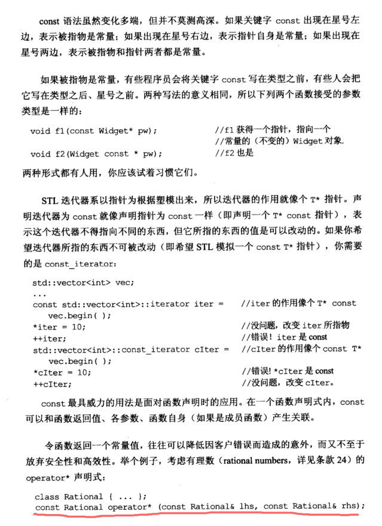

# Note

## other1

const 出现在星号左边，表示被指物是常量，如果出现在星号右边，表示指针本身是常量，如果出现在星号两边，表示被指物和指针都是常量

const最强的用法是在函数声明时，如果将返回值设置成const，或者返回指针设置成const，可以避免很多用户错误造成的意外。

概念上的const：

    考虑这样一段代码
    class CTextBlock{
        public:
            char& operator[](std::size_t position)const{
                return pText[position];
            }
        private:
            char *pText;
    }
    const CTextBlock cctb("Hello");
    char *pc = &cctb[0];
    *pc = 'J'
    这种情况下不会报错，但是一方面声明的时候说了是const，一方面还修改了值。这种逻辑虽然有问题但是编译器并不会报错

但是const使用过程中会出现想要修改某个变量的情况，而另外一部分代码确实不需要修改。这个时候最先想到的方法就是重载一个非const版本。
但是还有其他的方法，例如将非const版本的代码调用const的代码

## 总结：

+ 将某些东西声明为const可以帮助编译器检查出错误。
+ 编译器强制实施bitwise constneww，但是编写程序的时候应该使用概念上的常量性。
+ 当const和非const版本有着实质等价的实现时，让非const版本调用const版本可以避免代码重复

## other2

## 03 尽可能使用 const

补充 [const 用法总结](https://github.com/yuedaokong/Effective-Cpp-Learing/blob/main/Accustoming%20Yourself%20to%20C%2B%2B/02/const%E7%94%A8%E6%B3%95%E6%80%BB%E7%BB%93.md) 

### const 关键字

如果关键字 const 出现在星号左边，表示所指对象为常量；如果出现在星号右边，表示指针自身为常量；如果出现在两边，表示指针和所指对象皆为常量。

```cpp
char greeting[] = "Hello";
char* p = greeting;
const char* p = greeting; //常量指针
char const * p = greeting; //等同于上一条 
char* const p = greeting; //指针常量
const char* const p = greeting; //为一个指向常量对象的常量指针
```

STL 迭代器是以指针为原型，所以迭代器的作用就像个 T*指针。

```cpp
std::vector<int> vec;
...
const std::vector<int>::iterator iter = vec.begin(); //等同于 T* const
*iter = 10; //正确
++iter; //错误，指针为常量
std::vector<int>::const_iterator cIter = vec.begin(); //等同于 const T*
*cIter = 10; //错误，所指对象为常量
++cIter; //正确
```

const 最具威力的用法是面对函数声明时的应用，令函数返回值为一个常量时，可降低因客户错误而造成的意外，而又不至于放弃安全性和高效性。

```cpp
class Rational{...};
const Rational operator* (const Rational& lhs, const Rational& rhs);
```

可防止`if(a * b = c)...`的意外赋值的发生。

### const 成员函数

改善 C++ 程序效率的根本办法是以 *pass by reference-to-const* 方式传递对象。

```cpp
class TextBlock{
public:
	const char& operator[](std::size_t position) const
	{ return text[position]; }
};

void print(const TextBlock& ctb)
{
	std::cout << ctb[0];
	...
}
```

bitwise constness ( 又称 physical constness )，const 成员函数不可更改对象内任何 non-static 成员变量。但实际上，我们希望 const 成员函数是概念上的常量性，也就是所谓的 logical contness，即一个 const 成员函数可以修改它所处理的对象内的某些 bits，但只有在客户端侦测不出的情况下才可以。

```cpp
class CTextBlock{
public:
	...
	std::size_t length() const; //满足logical contness
private:
	char* pText;
	mutable std::size_t textLength; //加mutable后，在const成员函数内也可以被更改
	mutable bool lengthIsValid;
};
std::size_t CTextBlock::length() const
{
	if (!lengthIsValid){
		textLength = std::strlen(pText);
		lengthIsValid = true;
	}
}
```

### 在 const 和 non_const 成员函数中避免重复

常量性转除（casting away constness），避免 const 和 non_const 成员函数重复，在 non_const 中调用 const，反向在 const 中调用 non_const 不可取，改变 const 常量不变的规范。 

# Book





没用const 修饰返回值，那其实修改之后，编译器可以通过


