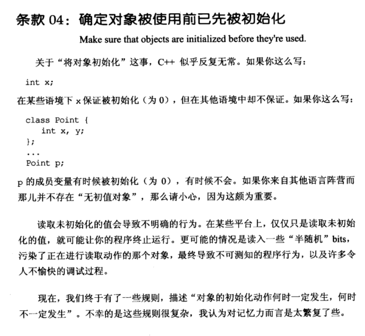
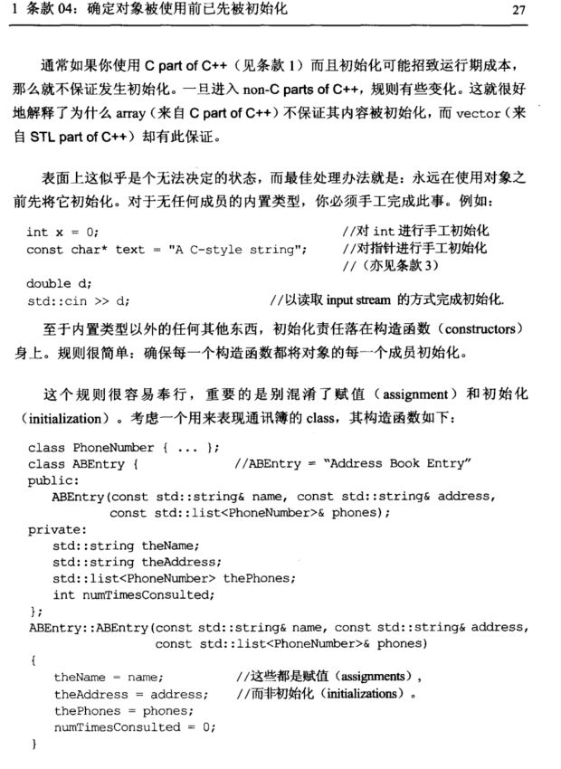
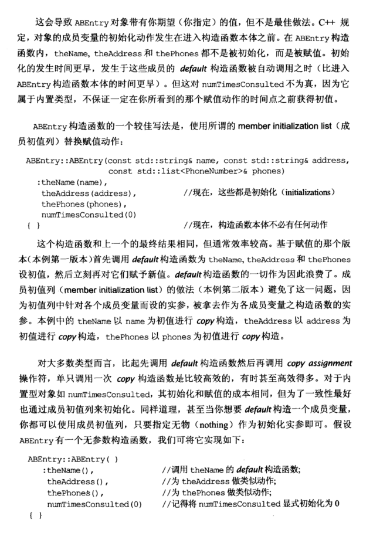
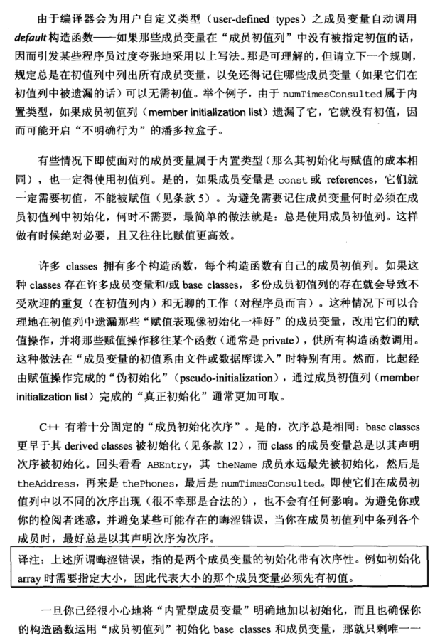
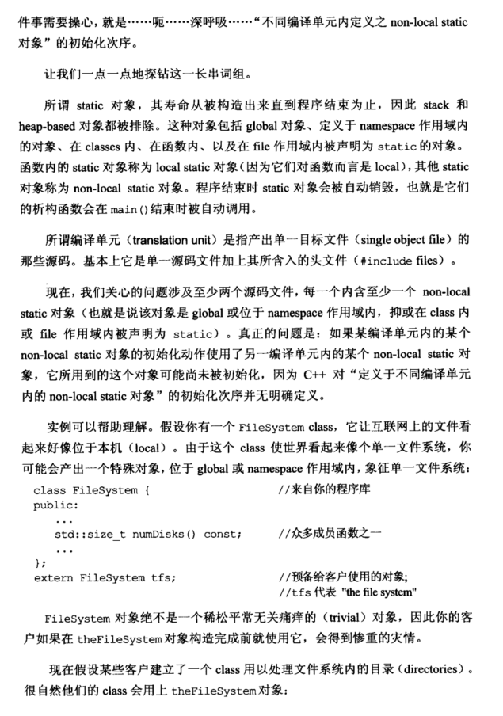
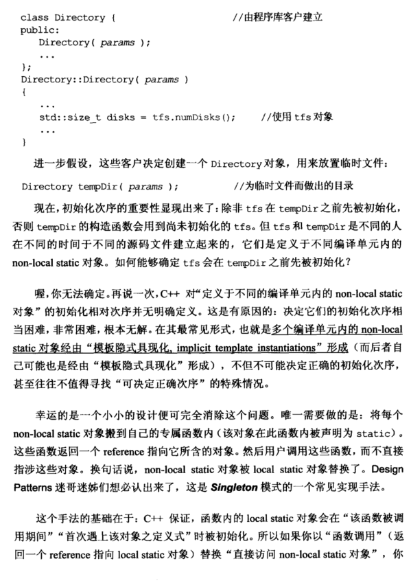
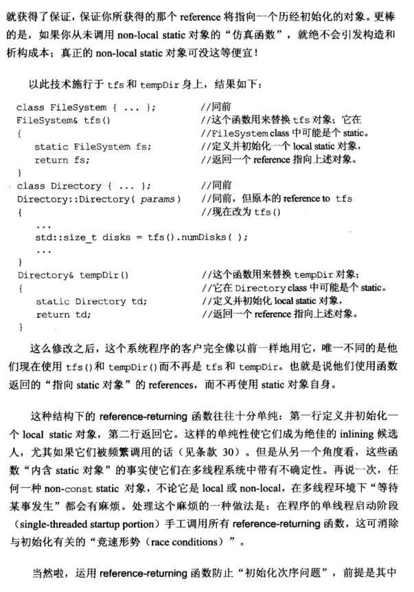
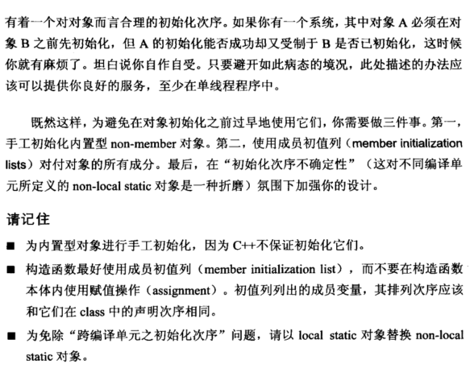

# Note

## other1

确定对象被使用前已先被初始化（Make sure that objects are initialized before they're used)**

对于C++中的C语言来说，初始化变量有可能会导致runtime的效率变低，但是C++部分应该手动保证初始化，否则会出现很多问题。

初始化的函数通常在构造函数上（注意区分初始化和赋值的关系，初始化的效率高，赋值的效率低，而且这些初始化是有次序的，base classes更早于他们的派生类（参看[C++ primer 二刷笔记](https://github.com/Tianji95/note-of-C-plus-plus-primer/blob/master/C%2B%2Bprimer%E4%BA%8C%E5%88%B7%E7%AC%94%E8%AE%B0.md)

==除了这些以外，如果我们有两个文件A和B，需要分别编译，A构造函数中用到了B中的对象，那么初始化A和B的顺序就很重要了，这些变量称为（non-local static对象）==

### 涉及单例模式知识

解决方法是：将每个non-local static对象搬到自己专属的函数内，并且该对象被声明为static，然后这些函数返回一个reference指向他所含的对象，用户调用这些函数，而不直接涉及这些对象（Singleton模式手法）：

    原代码：
    "A.h"
    class FileSystem{
        public:
            std::size_t numDisks() const;
    };
    extern FileSystem tfs;
    "B.h"
    class Directory{
        public:
            Directory(params){
                std::size_t disks = tfs.numDisks(); //使用tfs
            }
    }
    Director tempDir(params);
    修改后：
    "A.h"
    class FileSystem{...}    //同前
    FileSystem& tfs(){       //这个函数用来替换tfs对象，他在FileSystem class 中可能是一个static，            
        static FileSystem fs;//定义并初始化一个local static对象，返回一个reference
        return fs;
    }
    "B.h"
    class Directory{...}     // 同前
    Directory::Directory(params){
        std::size_t disks = tfs().numDisks();
    }
    Directotry& tempDir(){   //这个函数用来替换tempDir对象，他在Directory class中可能是一个static，
        static Directory td; //定义并初始化local static对象，返回一个reference指向上述对象
        return td;
    }

这样做的原理在于C++对于函数内的local static对象会在“该函数被调用期间，且首次遇到的时候”被初始化。当然我们需要避免“A受制于B，B也受制于A”

总结：

+ 为内置型对象进行手工初始化，因为C++不保证初始化他们
+ 构造函数最好使用初始化列初始化而不是复制，并且他们初始化时有顺序的
+ 为了免除跨文件编译的初始化次序问题，应该以local static对象替换non-local static对象

## other2

## 04 确定对象被使用前已先被初始化

读取未初始化的值会导致不明确的行为，最佳处理办法就是在使用对象前都进行初始化。

- 内置类型，手动进行初始化

  ```cpp
  int x = 0;
  const char* text = "A C-style string";
  
  double d;
  stf::cin >> d;
  ```

- 内置类型以外的，在构造函数进行初始化，注意赋值和初始化是不同的，初始化发生在赋值之前。

  ```cpp
  ABEntry::ABEntry(const std::string& name, const std::string& address,
  		  const std::list<PhoneNumber>& phones)
  		 :theName(name),
  		  theAddress(address),
  		  thePhones(phones),
  		  numTimeconsulted(0) //初始化列表 
  		  { }
  ```

  注：

  1. 总是在初始化列表中列出所有成员变量，以免还得记住哪些成员变量可以无需初始化。
  2. 如果成员变量是 const 或 references，一定要初始化，不能被赋值。
  3. 在类中有多个构造函数，且有大量重复初始化操作时，将一些赋值表现和初始化一样好的成员变量，抽象到一个函数内（通常 private），供所有构造函数调用。
  4. 成员初始化顺序固定与声明顺序相同，故最好初始化列表最好与声明顺序一致，也要尽量避免使用某些成员初始化其他成员。

    ```cpp
  class X {
    int i;
    int j;
  public:
    X(int val) : j(val), i(j) { } //会按照 i,j 顺序初始化，i 会用为定义的 j 进行初始化
  };
    ```

- 为免除 “ 跨编译单元的初始化顺序” 问题，以 local static 对象替换 non-local-static 对象。

  这里的 static 指从构造出来直到程序结束为止的量，例如 global 对象、定义于 namespace 作用域的对象、在 classes 内、在函数内、以及在 file 作用域内被声明为 static 的对象。
  函数内的 static 对象称为 local static 对象，其他 static 对象称为 non-local static 对象。

  ```cpp
  class FileSystem { 
  public:
  	...
  	std::size_t numDisks() const;
  	... 
  };
  //extern FileSystem tfs; //non-local-static
  FileSystem& tfs() //以 local static 对象替换 non-local-static 对象
  {
  	static FileSystem fs;
  	return fs;
  }
  class Directory {
  public:
  	Directory(params);
  	...
  };
  Directory::Directory(params)
  {
  	...
  	std::size_t disks = tfs.numDisks();
  	...
  }
  Directory& tempDir() //以 local static 对象替换 non-local-static 对象
  {
  	static Directory td;
  	return td; 
  }
  Directory tempDir(params); //
  ```

  C++ 保证，函数内的 local static 对象会在函数调用期间，首次遇上该对象之定义式时被初始化；

  返回一个 reference 指向 local static 对象，可以保证获得一个历经初始化的对象；

  在未调用 non-local-static 对象的 local static 函数时，不会发生构造和析构成本。

  注：

  任何一种 non-const static 对象，不论 local 或 non-local，在多线程环境下 “等待某事发生” 都会有麻烦发生，此方法在单线程程序中可提供良好的服务。


# Book





















