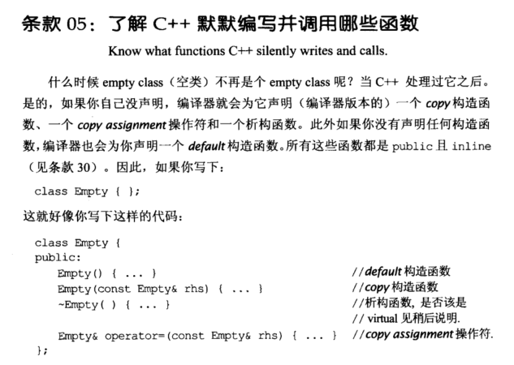

# Note

## other1

## 05 了解 C++ 默默编写并调用哪些函数

如果未声明拷贝构造函数、拷贝赋值函数、析构函数、构造函数，编译器会声明它们，且都为 public inline 的。

```cpp
class Empty { };
// 等同于
class Empty { 
public:
	Empty() { ... }                             //默认构造函数
	Empty(const Empty& rhs) { ... }             //拷贝构造函数 
	~Empty() { ... }                            //析构函数，编译器产生的是non-virtual
	Empty& operator=(const Empty& rhs) { ... }  //拷贝赋值函数
}; 
```

当声明了一个构造函数后，编译器就不再生成默认构造，这样就会发生被默认构造覆盖的情况。

==需自定义拷贝赋值函数的情况==

1. 类中内含 reference 成员时，虽然可以将一个新值赋予一个引用成员，但这样做改变的是引用指向的对象的值，而不是引用本身，赋值后引用仍然指向赋值之前的值；

   `std::string& namsValue;`

2. 类中内含 const 成员时，因为 const 不允许更改；

   `cosnt T objectValue;`

3. 如果基类的拷贝赋值函数声明为 private，派生类生成的默认拷贝赋值函数无法处理基类成员。

## other2

了解C++ 那些自动生成和调用的函数（Know what functions C++ silently writes and calls)**


总结：

+ 编译器可以自动为class生成default构造函数，拷贝构造函数，拷贝赋值操作符，以及析构函数


# Book




