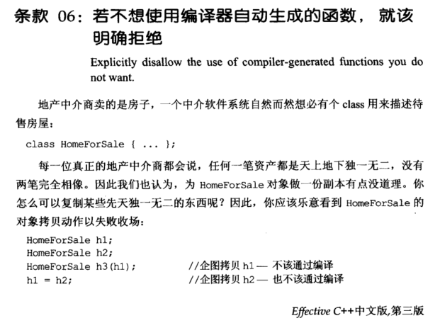
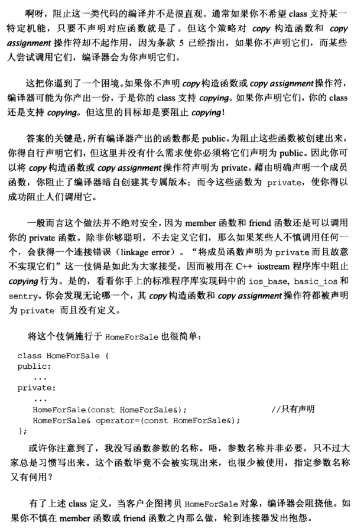
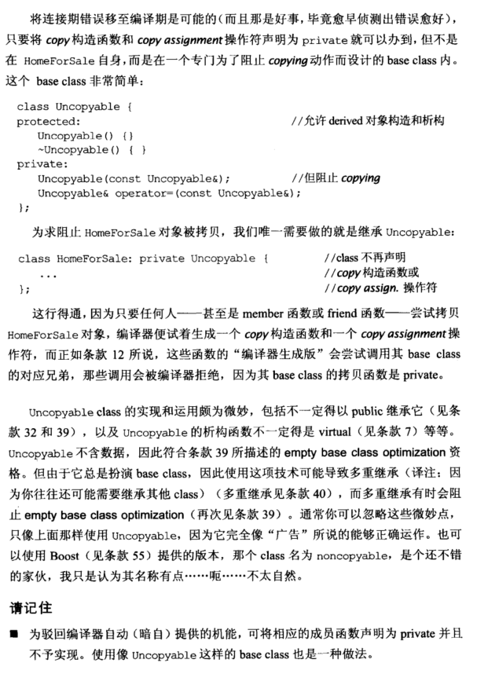

# Note

## other1

## 06 若不想使用编译器自动生成的函数，就该明确拒绝

通常如果不希望 class 支持某一特定功能，只要不声明对应函数就可以了。==但拷贝构造函数和拷贝赋值函数，会在被某人调用时，编译器自动声明。==

以下两种方式可解决此问题：

###  private 拷贝控制

明确声明拷贝构造函数和赋值构造函数可阻止编译器自动生成，将它们限定为 private，可成功阻止人们调用它们。

```cpp
class HomeForSale {
public:
	...
private:
	...
	HomeForSale(const HomeForSale&);
	HomeForSale& operator=(const HomeForSale&);
};
```

一般而言这种做法不是绝对安全，==因为 member 函数和 friend 函数还是可以调用你的 private 函数，为此可专门设计一个基类去阻止 *copying* 操作。==

```cpp
class Uncopyable {
protected:
	Uncopyable() { }
	~Uncopyable() { }
private:
	Uncopyable(const Uncopyable&);
	Uncopyable& operator=(const Uncopyable&);
};

class HomeForSale: private Uncopyable {
	...
};
```

==为阻止 HomeForSale 的对象被拷贝，只需继承 Uncopyable。==

### C++11 "=delete" 定义删除函数

```cpp
class HomeForSale {
public:
  	...
	HomeForSale(const HomeForSale&) = delete;
	HomeForSale& operator=(const HomeForSale&) = delete;
};
```

## =default

与 =default比较

1. ===default可在声明处和定义处==，而 =delete 必须出现在函数第一次声明处。==因为 =default 直到编译器生成代码时才需要==，而 =delete 编译时就需知道它是删除的，以便阻止试图使用它的操作。
2. ===default 只能指定编译器可自动生成的函数==，而 =delete 可指定任何函数。

注意析构函数不能是删除成员，如果类的某个成员的析构函数是删除的或不可访问的（private），则类的合成析构函数被定义为删除，其成员的合成默认和拷贝构造函数也被定义为删除，以防创建出无法被销毁的对象。


## other2

### 若不想使用编译器自动生成的函数，就该明确拒绝（Explicitly disallow the use of compiler-generated functions you do not want)

这一条主要是针对类设计者而言的，有一些类可能从需求上不允许两个相同的类，例如某一个类表示某一个独一无二的交易记录，那么编译器自动生成的拷贝和复制函数就是无用的，而且是不想要的

总结：

+ ==可以将不需要的默认自动生成函数设置成delete的或者弄一个private的父类并且继承下来==


# Book









