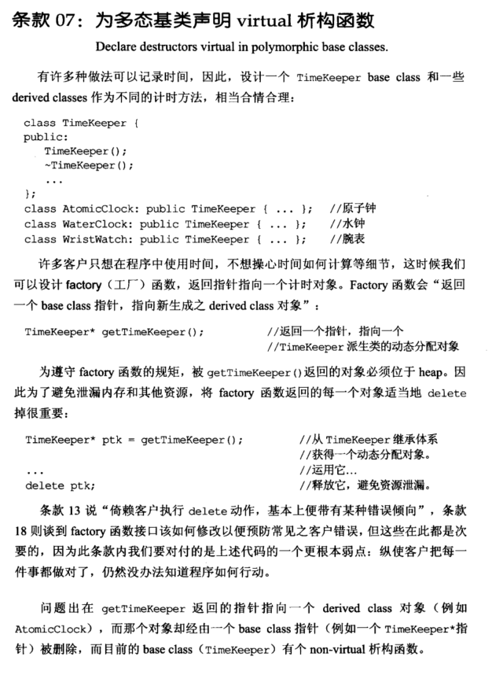
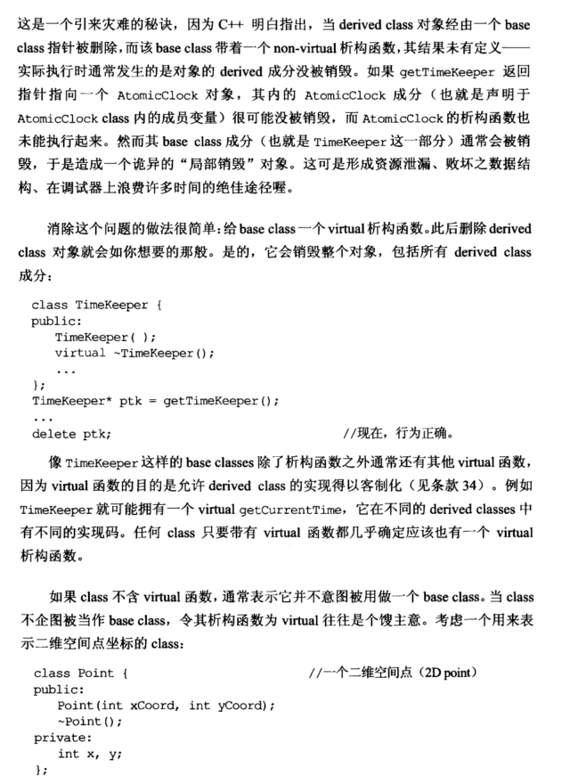
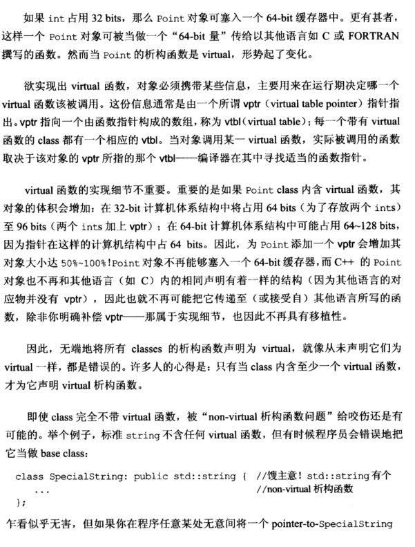
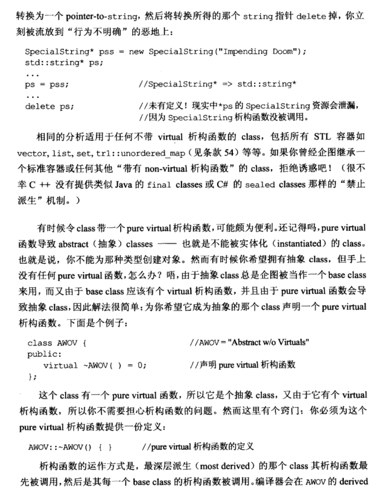
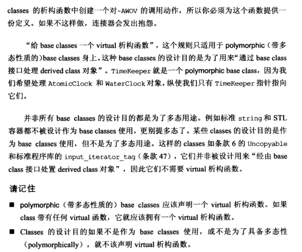

# Note

## other1

## 07 为多态基类声明 virtual 析构函数

对于一个多态基类通常要将析构函数声明为 virtual。

```cpp
class TimeKeeper {
public:
	TimeKeeper();
	virtual ~TimeKeeper(); //基类的析构函数声明为虚函数
};
class AtomicClock: public TimeKeeper { ... };
class WaterClock: public TimeKeeper { ... };
class WristWatch: public TimeKeeper { ... };
TimeKeeper* ptk = getTimeKeeper();
...
delete ptk;
```

==如果基类析构函数不声明为虚函数，delete 时，基类的成分通常会被销毁，而派生类的成分没被销毁，从而造成 “局部销毁”，会导致内存泄漏==、败坏数据结构、调整器时间浪费。

使用 virtual 析构函数的注意事项

1. ==任何 class 只要带有 virtual 函数都几乎确定应该也有一个 virtual 析构函数==

2. 如果 class 不含 virtual 函数，通常表示它并不打算作为基类，如果无端地将所有的 classes 的析构函数都声明为 virtual，可能出现以下问题：

   - ==实现 virtual 函数，要在运行期间决定哪个 virtual 函数被调用，vptr (virtual table poiner) 指向一个函数指针构成的数组 vtbl (virtual table)，这会使对象的占用体积增加.==
   - 带有 virtual 函数对象也不再和其他语言声明有相同结构，因此也不再可能把它传递至其他语言所写的函数，除非明确补偿 vptr，因此不再具有**移植性**。

3. ==不要继承一个标准容器或任何其他 ”带有 non-virtual 析构函数“ 的 class==

   ```cpp
   class SpecialString: public std::string {
   	...
   };
   SpecialString* pss = new SpecialString("Impending Doom");
   std::string* ps;
   ...
   ps = pss;
   ..
   delete ps; // SpecialString的析构未被调用，*ps的SpecialString资源会泄露
   ```

4. ==令抽象类带一个纯虚析构函数十分便利，但必须为这个纯虚函数提供一个定义==，由于析构函数的运作方式是先调用 most derived 的析构函数，再调用每个 base class 的析构函数，层层向外。

   ```cpp
   class AWOV {
   public:
   	virtual ~AWOV() = 0; //声明纯虚析构
   };
   AWOV::~AWOV() { } //纯虚析构定义
   ```

## other2

**7. 为多态基类声明virtual析构函数（Declare destructors virtual in polymorphic base classes)**

其主要原因是如果基类没有virtual析构函数，那么派生类在析构的时候，如果是delete 了一个base基类的指针，那么派生的对象就会没有被销毁，引起内存泄漏。
例如：
    

```cpp
class TimeKeeper{
    public:
    TimeKeeper();
    ~TimeKeeper();
    virtual getTimeKeeper();
}
class AtomicClock:public TimeKeeper{...}
TimeKeeper *ptk = getTimeKeeper();
delete ptk;
```

除析构函数以外还有很多其他的函数，==如果有一个函数拥有virtual 关键字，那么他的析构函数也就必须要是virtual的==，但是如果class不含virtual函数,析构函数就不要加virtual了，因为一旦实现了virtual函数，那么对象必须携带一个叫做vptr(virtual table pointer)的指针，这个指针指向一个由函数指针构成的数组，成为vtbl（virtual table），这样对象的体积就会变大，例如：

```cpp
class Point{
    public://析构和构造函数
    private:
    int x, y
}
```

本来上面那个代码只占用64bits(假设一个int是32bits)，存放一个vptr就变成了96bits，因此在64位计算机中无法塞到一个64-bits缓存器中，也就无法移植到其他语言写的代码里面了。

## 总结：

+ ==如果一个函数是多态性质的基类，应该有virtual 析构函数==
+ ==如果一个class带有任何virtual函数，他就应该有一个virtual的析构函数==
+ ==如果一个class不是多态基类，也没有virtual函数，就不应该有virtual析构函数==

# Book









