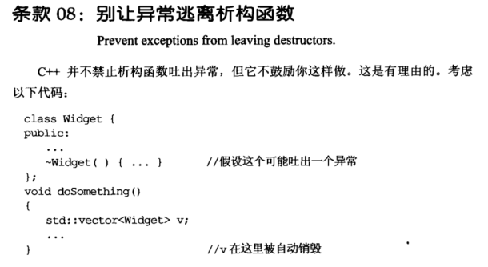
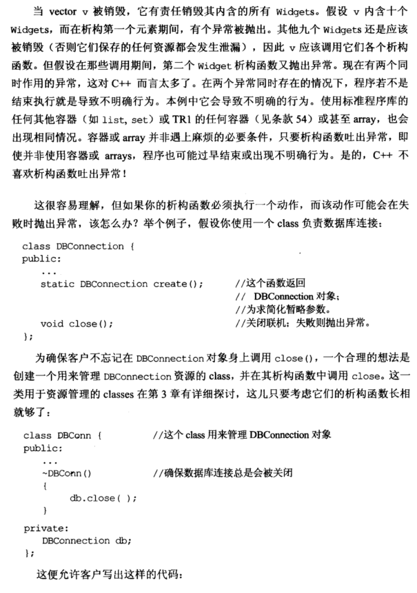
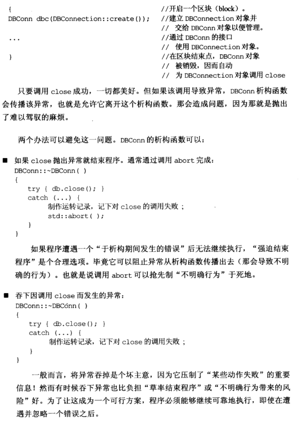
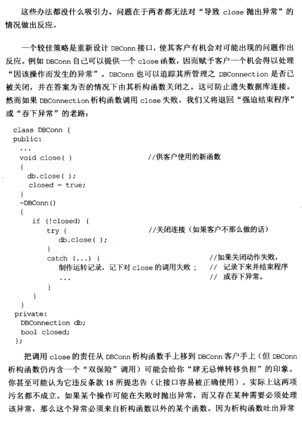
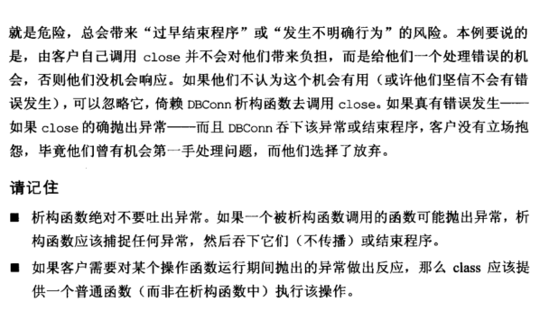

# Note

## other1

## 08 别让异常逃离析构函数

在两个异常同时存在的情况下（两个异常对于 C++ 来说太多了），程序若不是结束执行就是导致不明确行为。

如果析构函数必须执行一个动作，而动作可能会在失败时，抛出异常，该怎么办？

```cpp
class DBconnection {
public:
	...
	static DBConnection create();
	void close();
};
//创建一个DBConn类管理DBConnection的资源，防止用户忘记调用close
class DBConn {
public:
	...
	~DBConn()
	{
		db.close();
	}
};
//通过DBConn接口调用DBConnection对象，并销毁
{
	DBConn dbc(DBConnection::create());
	...
}
```


以上程序，如果在调用出现异常的情况下，DBConn 析构函数会传播该异常，离开这个析构，导致没有完全销毁。

比较好的处理办法就是重新设计 DBConn 接口，使其用户有机会对可能出现的问题作出反应，并且在析构函数中结束程序或吞下异常（有时候吞下异常也比负担 “草率结束程序” 或 “不明确行为带来的风险” 好），提供双保险。

```cpp
class DBConn {
public:
	...
	void close(){                           //用户可选择是否调用close
		db.close();
		closed = true;
	}
	~DBConn(){
		if (!closed){
			try {
				db.close();
			}catch (...){           //如果关闭动作失败
				...             //记录下来并结束程序或吞下异常
				std::abort();   //abort强制中止当前程序
			}
		}
	}
private:
	DBConnection db;
	bool closed;
};
```

## other2

### **8. 别让异常逃离析构函数（Prevent exceptions from leaving destructors)**

这里主要是因为如果循环析构10个Widgets，如果每一个Widgets都在析构的时候抛出异常，就会出现多个异常同时存在的情况，这里如果把每个异常控制在析构的话就可以解决这个问题：解决方法为：

原代码：

```cpp
class DBConn{
public:
    ~DBConn(){
        db.close();
    }
private:
    DBConnection db;
}
```

修改后的代码：
    

```cpp
class DBConn{
public:
    void close(){
        db.close();
        closed = true;
    }

    ~DBConn(){
        if(!closed){
            try{
                db.close();
            }
            catch(...){
                std::abort();
            }
        }
    }
private:
    bool closed;
    DBConnection db;
}
```

这种做法就可以一方面将close的的方法交给用户，另一方面在用户忽略的时候还能够做“强迫结束程序”或者“吞下异常”的操作。相比较而言，交给用户是最好的选择，因为用户有机会根据实际情况操作异常。

总结：

+ ==析构函数不要抛出异常，因该在内部捕捉异常==
+ ==如果客户需要对某个操作抛出的异常做出反应，应该将这个操作放到普通函数（而不是析构函数）里面==

# Book












==给用户机会调用普通函数来关闭，如果用户没有去关闭，我们在析构函数中进行处理。==

