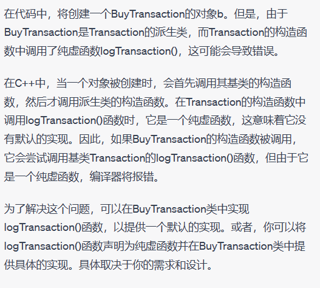
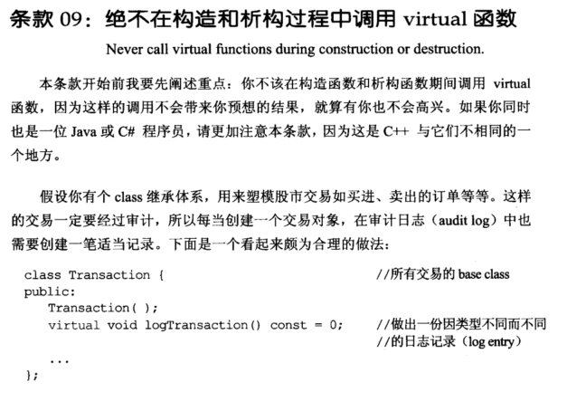
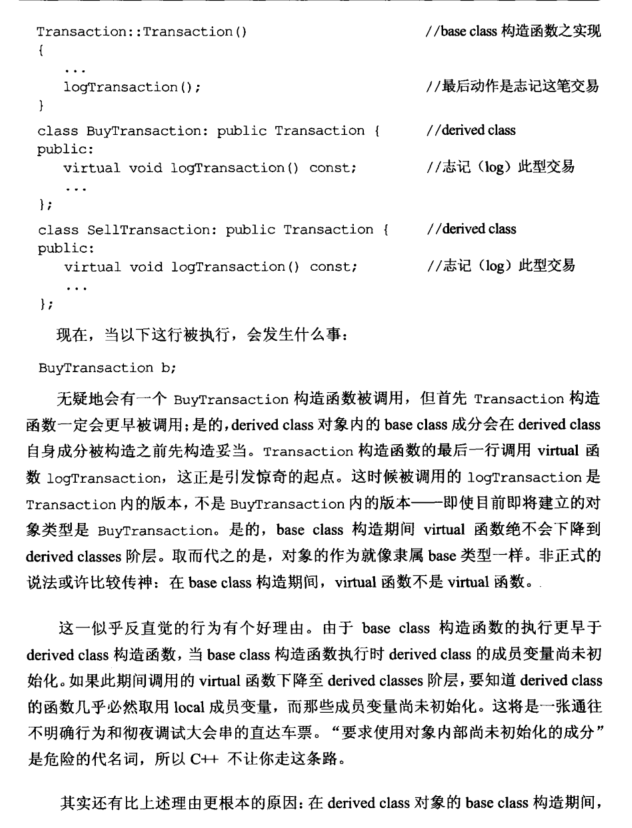
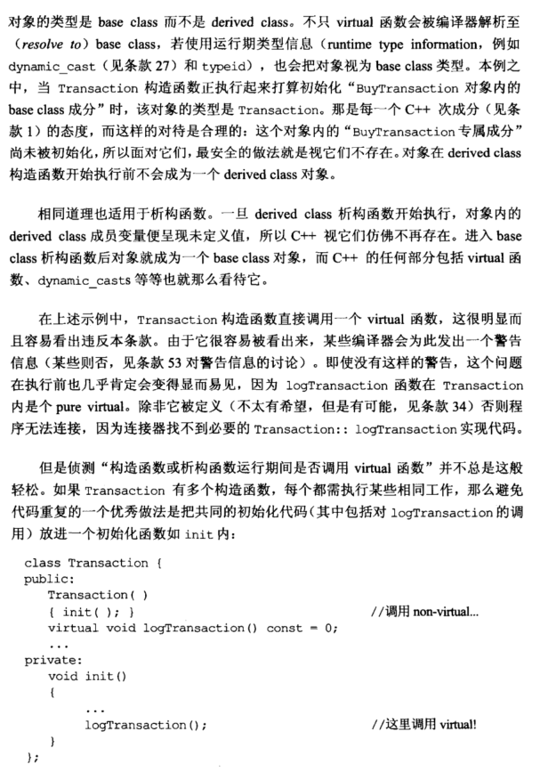
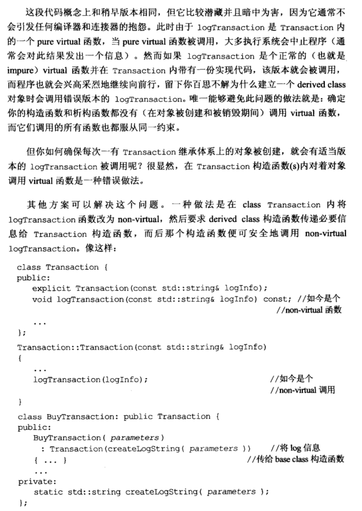
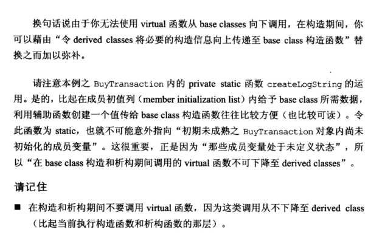

# Note

## other1

## 09 绝不在构造和析构过程中调用 virtual 函数

```cpp
class Transaction {
public:
	Transaction();
	virtual void logTransaction() const = 0; //做出一份因类型不同而不同的日志记录
	...
};
Transaction::Transaction()
{
	...
	logTransaction();
}
class BuyTransaction:public Transaction{
public:
	virtual void logTransaction() const;
}
class SellTransaction:public Transaction{
public:
	virtual void logTransaction() const;
};
BuyTransaction b;
```

上述程序运行，==基类构造会在派生类构造之前，基类构造内部 virtual 函数不会下移到派生类。
由于此时派生类未被初始化，基类构造函数内部 virtual 函数不会执行，析构函数会发生同样问题。==

解决方案是将 virtual 改为 non-virtual 函数，令 derived classes 将必要的构造信息向上传递至 base class 构造函数。



## other2

**9. 绝不在构造和析构过程中调用virtual函数（Never call virtual functions during construction or destruction)**

主要是因为有继承的时候会调用错误版本的函数，例如

原代码：

```cpp
class Transaction{
public:
    Transaction(){
        logTransaction();
    }
    Virtual void logTransaction const() = 0;
};
class BuyTransaction:public Transaction{
    public:
        virtual void logTransaction() const;
};
BuyTransaction b;

或者有一个更难发现的版本：

class Transaction{
public:
    Transaction(){init();}
    virtual void logTransaction() const = 0;
private:
    void init(){
        logTransaction();
    }
};
```


这个时候代码会调用 Transaction 版本的logTransaction，因为在构造函数里面是先调用了父类的构造函数，所以会先调用父类的logTransaction版本，解决方案是不在构造函数里面调用，或者将需要调用的virtual弄成non-virtual的

修改以后：

```cpp
class Transaction{
public:
    explicit Transaction(const std::string& logInfo);
    void logTransaction(const std::string& logInfo) const; //non-virtual 函数
}
Transaction::Transaction(const std::string& logInfo){
    logTransaction(logInfo); //non-virtual函数
}
class BuyTransaction: public Transaction{
public:
    BuyTransaction(parameters):Transaction(createLogString(parameters)){...} //将log信息传递给base class 构造函数
private:
    static std::string createLogString(parameters); //注意这个函数是用来给上面那个函数初始化数据的，这个辅助函数的方法
}
```

总结：

+ ==在构造和析构期间不要调用virtual函数，因为这类调用从不下降至派生类的版本==

# Book









