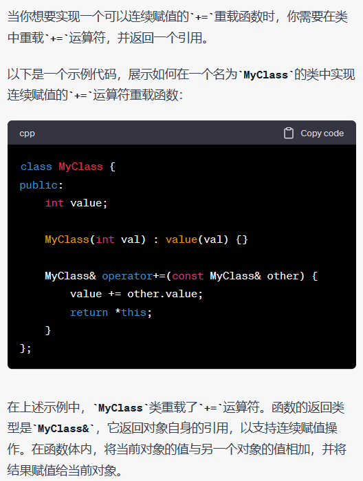
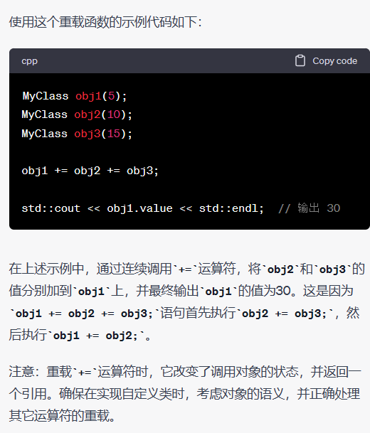
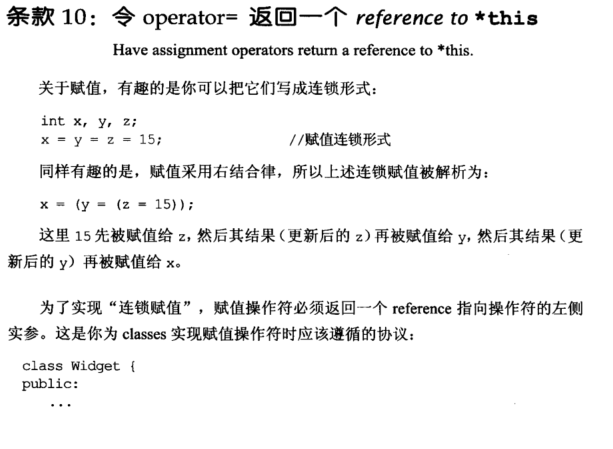
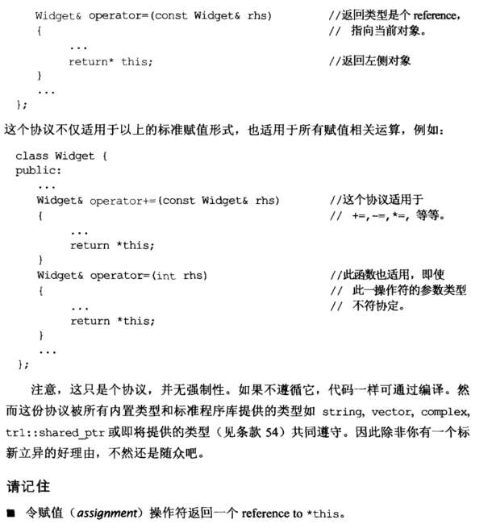

# Note

## other1

**10. 令operator= 返回一个reference to *this （Have assignment operators return a reference to *this)**

主要是为了支持连读和连写，例如：
    

```cpp
class Widget{
public:
    Widget& operator=(int rhs){return *this;}
}
a = b = c;
```


## other2

## 10 令 operator= 返回一个 *reference to* ***this**

为了实现 “连锁赋值”，赋值操作符必须返回一个 reference 指向操作符的左侧实参。

```cpp
class Widget {
public:
	...
	Widget& operator+=(const Widget& rhs) //-=,*=,等等
	{
		...
		return *this;
	}
	Widget& operator=(int rhs)
	{
		...
		return *this;
	}
	...
};
int x, y, z;
x = y = z = 15; //连锁赋值
```

# 举例





# Book



