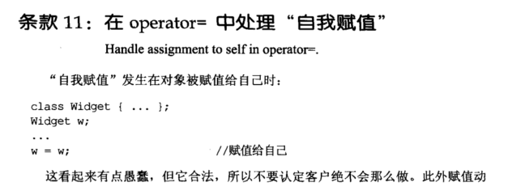
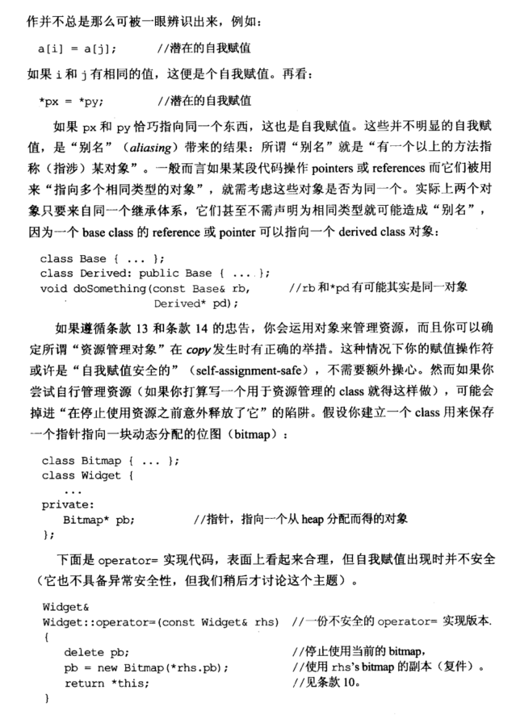
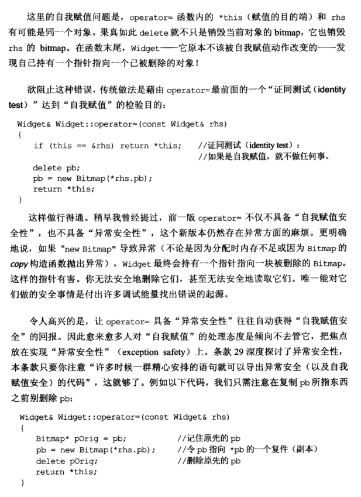
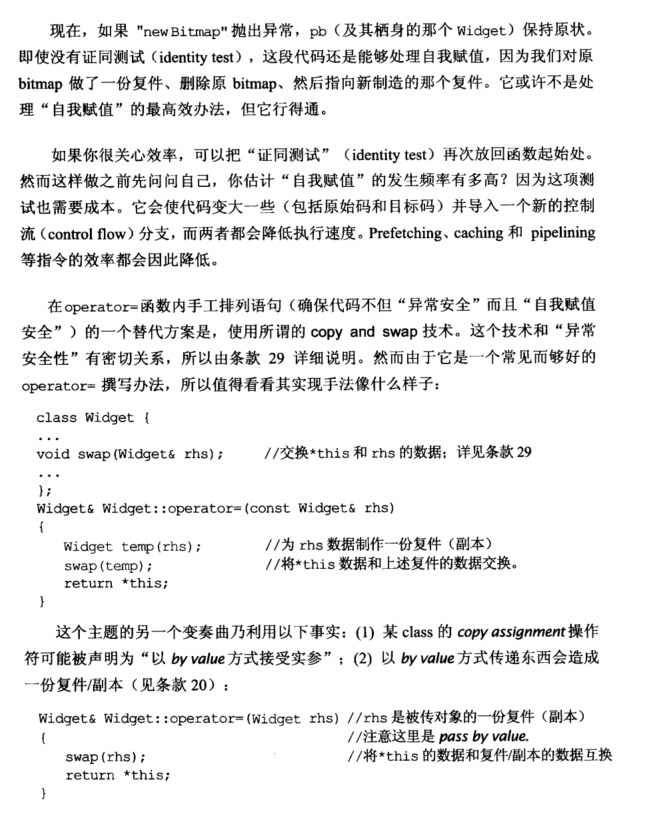
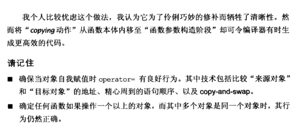

# Note

## other1

## 11 在 operator= 中处理 “自我赋值”

“自我赋值” 发生在对象赋值给自己时：

```cpp
class Widget { ... };
Widget w;
...
w = w;       //赋值给自己

a[i] = a[j]; //潜在的自我赋值，如果i和j有相同的值
*px = *py;   //潜在的自我赋值，如果px和py指向相同对象
```

一般而言如果某段代码操作 pointers 或 references 而它们被利用来指向多个相同类型对象，就需考虑这些对象是否为同一个；实际上两个对象只要来自同一个继承体系，它们甚至不需要声明为相同类型就可能发生 “别名”（自我赋值），因为一个 base class 的 reference 或 pointer 可以指向一个 derived class 的对象。

```cpp
class Base { ... };
class Derived: public Base { ... };
void doSomething(const Base& rb, Derived* pd) //rb和*pd有可能其实时同一对象
```

在发生赋值上述程序是安全的，然而如果你打算尝试自行管理资源可能会掉进 “在停止使用资源之前意外释放了它” 的陷阱。

```cpp
class Bitmap { ... };
class Widget {
	...
private:
	Bitmap* pb;
};
Widget& Widget::operator=(const Widget& rhs)
{
	delete pb;                //停止使用当前的pb
	pb = new Bitmap(*rhs.pb); //使用rhs的bitmap副本
	return *this; 
}
```

其中 operator= 函数中 *this 和 rhs 有可能是同一个对象，delete 销毁后，指针指向一个已删除的对象。

- 欲阻止这种错误，传统做法是加入**证同测试（identify test）** 达到自我赋值的目的：

  ```cpp
  Widget& Widget::operator=(const Widget& rhs)
  {
  	if (this == &rhs) return *this; //证同测试，如果是自我赋值，就不做任何事
  	delete pb;                      //停止使用当前的pb
  	pb = new Bitmap(*rhs.pb);       //使用rhs的bitmap副本
  	return *this; 
  }
  ```

- 让 operator= 具备 “异常安全性” 往往自动获得 “自我赋值安全” 的回报，因此可把焦点放到 “异常安全性”上。具体做法，可对 bitmap 做一份副本，删除原 bitmap。

  

  ==将原对象暂时储存== 也可以防止自我赋值

  ```cpp
  Widget& Widget::operator=(const Widget& rhs)
  {
  	Bitmap* pOrig = pb;       //记住原先的pb
  	pb = new Bitmap(*rhs.pb); //使用rhs的bitmap副本
  	delete pOrig;             //删除原先的pb
  	return *this; 
  }
  ```

  

- 在 operator= 函数内手工排序语句的一个替代方案是，使用所谓的 copy and swap 技术，它和 “异常安全性” 有密切关系。详细说明见 [29 为 “异常安全” 而努力是值得的]()

  

  ==swap将rhs的所有权拿过来==

  ```cpp
  class Widget {
  ...
  void swap(Widget& rhs);        //交换*this和rhs数据
  ...
  };
  Widget& Widget::operator=(const Widget& rhs)
  {
  	Widget temp(rhs);       //为rhs数据制作一份副本
  	swap(temp);	        //将*this数据和上述副本的数据交换
  	return *this; 
  }
  //以值传递的方式，代替制作副本
  Widget& Widget::operator=(Widget rhs)
  {
  	swap(rhs);	        //将*this数据和副本的数据交换
  	return *this; 
  }
  ```

  第二种做法牺牲了代码的清晰可读性，将 “*copying* 动作” 从函数本体移至函数参数构造阶段，但更加高效。

## other2


### **11. 在operator= 中处理“自我赋值” （Handle assignment to self in operator=)**

主要是要处理 a[i] = a[j] 或者 *px = *py这样的自我赋值。有可能会出现一场安全性问题，或者在使用之前就销毁了原来的对象，例如

原代码：
    

```cpp
class Bitmap{...}
class Widget{
private:
    Bitmap *pb;
};
Widget& Widget::operator=(const Widget& rhs){
    delete pb; // 当this和rhs是同一个对象的时候，就相当于直接把rhs的bitmap也销毁掉了
    pb = new Bitmap(*rhs.pb);
    return *this;
}
```

修改后的代码

```cpp
class Widget{
    void swap(Widget& rhs);    //交换this和rhs的数据
};
Widget& Widget::operator=(const Widget& rhs){
    Widget temp(rhs)           //为rhs数据制作一个副本
    swap(temp);                //将this数据和上述副本数据交换
    return *this;
}//出了作用域，原来的副本销毁
```

或者有一个效率不太高的版本：
    Widget& Widget::operator=(const Widget& rhs){
        Bitmap *pOrig = pb;       //记住原先的pb
        pb = new Bitmap(*rhs.pb); //令pb指向 *pb的一个副本
        delete pOrig;            //删除原先的pb
        return *this;
    }

总结：

+ 确保当对象自我赋值的时候operator=有比较良好的行为，包括两个对象的地址，语句顺序，以及copy-and-swap
+ ==确定任何函数如果操作一个以上的对象，而其中多个对象可能指向同一个对象时，仍然正确==


#### 生命周期   类的名字改名


# Book












