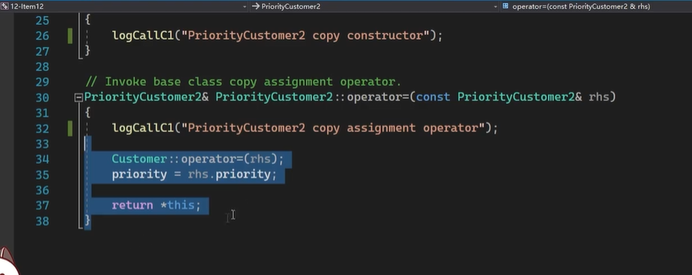
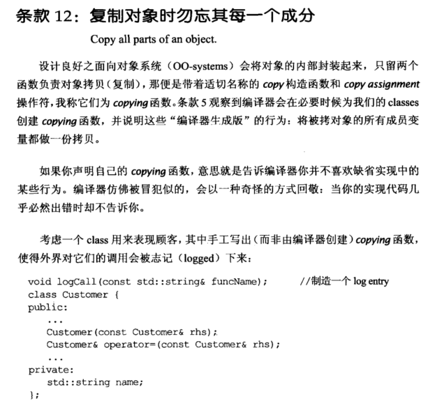
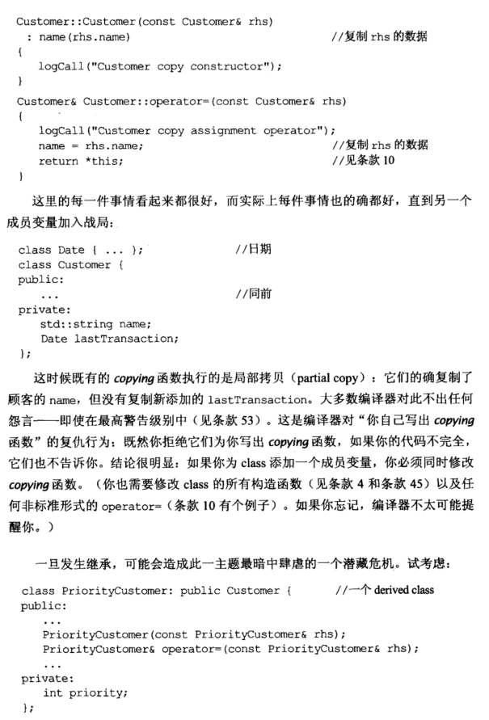
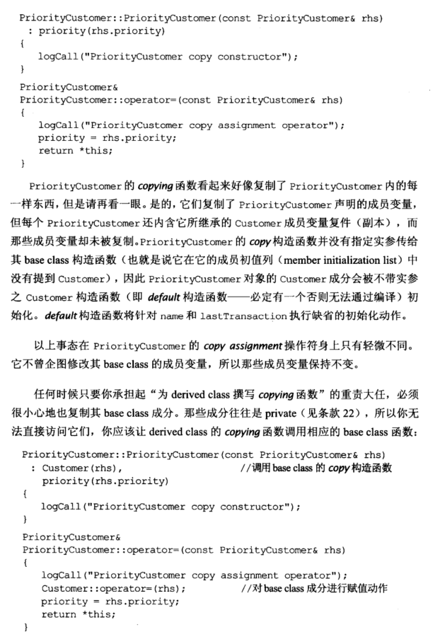
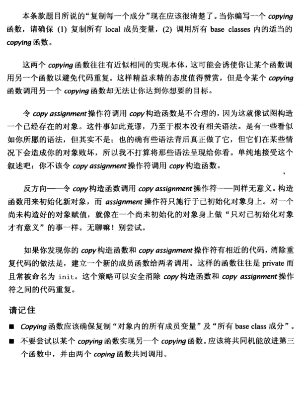

# Note

## other1

## 12 复制对象时勿忘其每个成分

当在类中声明自定义的 *copying* 函数（拷贝构造函数和拷贝赋值函数）时，缺少复制对象，编译器不会报错。

```cpp
void logCall(const std::string& funcName);
//class Date { ... };
class Customer {
public:
	...
	Customer(const Customer& rhs);
	Customer& operator=(const Customer& rhs);
	...
private:
	std::string name;
	//Date lastTransaction;
};
Customer::Customer(const Customer& rhs)
 : name(rhs.name)
{
	logCall("Customer copy constructor");
}
Customer& Customer::operator=(const Customer& rhs)
{
	logCall("Customer copy assignment operator");
	name = rhs.name;
	return *this;
}
```

上述程序，加入 Data lastTransaction; 的同时拷贝构造函数和赋值构造函数也要修改。如果忘记，编译器不会报错。


一旦发生继承，要为 derived class 的 *copying* 函数复制 base class 成分。这些成分往往是 private 的，所以无法直接访问，应让 derived class 的 *copying* 函数调用相应的 base class 函数：

```cpp
class PriorityCustomer: public Customer {
public:
	...
	PriorityCustomer(const PriorityCustomer& rhs);
	PriorityCustomer& operator=(const PriorityCustomer& rhs);
	...
private:
	int priority;
};
PriorityCustomer::PriorityCustomer(const PriorityCustomer& rhs)
 : Customer(rhs), rhs.priority(rhs) //调用base class的拷贝构造
{
	logCall("PriorityCustomer copy constructor");
}
PriorityCustomer& PriorityCustomer::operator=(const PriorityCustomer& rhs)
{
	logCall("PriorityCustomer copy assignment operator");
	Customer::operator=(rhs); //对base class成分进行赋值
	priority = rhs.priority;
	return *this;
}
```

如果拷贝构造函数和拷贝赋值函数有相近代码，不要二者相互之间调用。消除重复代码的做法是，建立一个新的成员函数给两者调用，这样的函数往往是 private 而且常被命名为 init。


有继承出现，那么派生类中的重载复制操作，需要调用基类的赋值操作




## other2

**12. 复制对象时勿忘其每一个成分 （Copy all parts of an object)**

总结：

+ ==当编写一个copy或者拷贝构造函数，应该确保复制成员里面的所有变量，以及所有基类的成员==
+ 不要尝试用一个拷贝构造函数调用另一个拷贝构造函数，如果想要精简代码的话，应该把所有的功能机能放到第三个函数里面，并且由两个拷贝构造函数共同调用
+ 当新增加一个变量或者继承一个类的时候，很容易出现忘记拷贝构造的情况，所以每增加一个变量都需要在拷贝构造里面修改对应的方法


### #pragma once

# Book

如果我们复制过程中，漏了成员对象的复制

每添加一个成员变量，都要去修改复制函数














