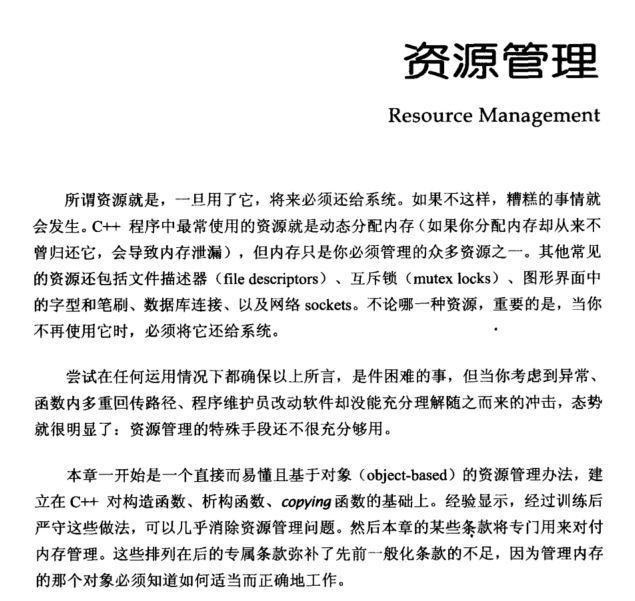
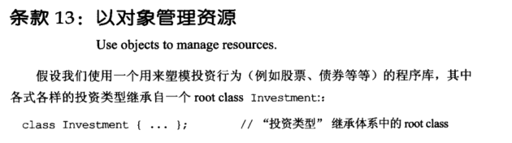
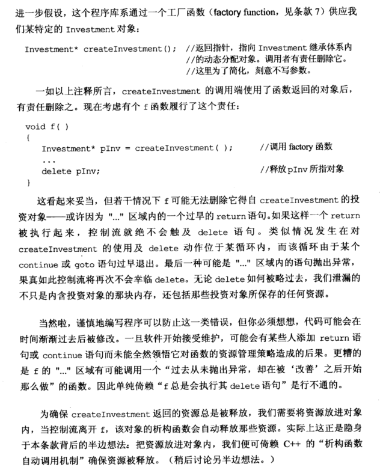
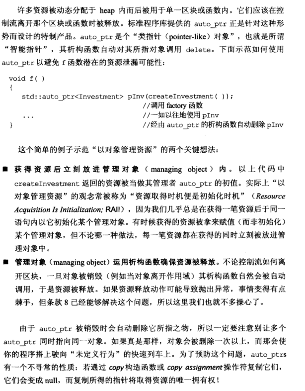
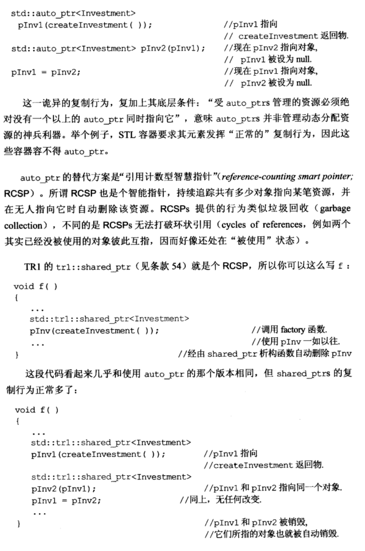
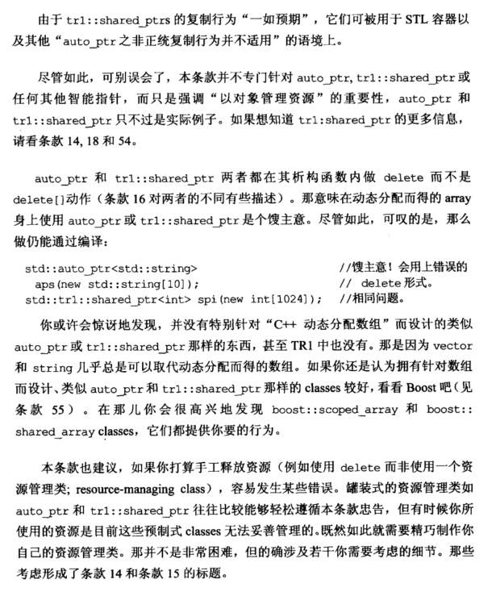
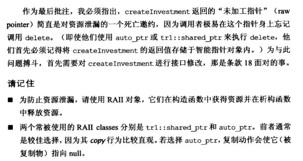

# Note

## other1

## 13 以对象管理资源

```cpp
void f()
{
	Investment* pInv = createInvestment(); //返回指针，指向Investment继承体系内的动态分配对象
	...
	delete pInv; //释放pInv所指对象
}
```

上诉程序可能由于中间过早 return，未执行 delete；delete 位于循环内，在 delete 之前 continue 或 goto 过早退出；中间抛出异常，未执行 delete。解决方法就是把资源放进对象内，让析构函数自动调用进行销毁，为此可引入智能指针。

C++里面的四个[智能指针](https://so.csdn.net/so/search?q=%E6%99%BA%E8%83%BD%E6%8C%87%E9%92%88&spm=1001.2101.3001.7020)：auto_ptr、unique_ptr、shared_ptr、weak_ptr，其中后三个是C++11支持，而这个auto_ptr已经被C++11弃用。

### auto_ptr

auto_ptr 是个类指针对象，其析构函数自动对其所指对象调用 delete。

```cpp
void f()
{
	std::auto_ptr<Investment> pInv(createInvestment()); //经由auto_ptr的析构函数自动删除
	...
}
```

auto_ptr 不能同时指向同一对象，通过拷贝构造或拷贝赋值函数复制后，原指针会指向 nullptr。

```cpp
std::auto_ptr<Investment> pInv1(createInvestment());
std::auto_ptr<Investment> pInv2(pInv1); //pInv2指向对象，pInv1被设为null
pInv1 = pInv2; //pInv1指向对象，pInv2被设为null
```

### shared_ptr

auto_ptr 的替代方案为引用计数型智慧指针 ( *reference-counting smart pointer；* RCSP )，即持续跟踪共有多少对象指向某笔资源，并在无人指向它时自动删除该资源。

 ```cpp
std::shared_ptr<Investment> pInv1(createInvestment());
std::shared_ptr<Investment> pInv2(pInv1); //pInv1和pInv2指向同一对象
pInv1 = pInv2; //pInv1和pInv2指向同一对象
 ```

auto_ptr 和 shared_ptr 两者都在其析构函数内做 delete 而不是 delete[]，意味着最好不要在动态分配的 array 身上使用两者，尽量用 string 和 vector 完成类似操作。


### shared_ptr会解决unique_ptr 不可复制的问题，shared_ptr但会出现循环引用，weak_ptr会解决shared_ptr的循环引用的问题


## other2

**13. 以对象管理资源 （Use objects to manage resources)**

主要是为了防止在delete语句执行前return，所以需要用对象来管理这些资源。这样当控制流离开f以后，该对象的析构函数会自动释放那些资源。
例如shared_ptr就是这样的一个管理资源的对象。他是在自己的析构函数里面做delete操作。所以如果自己需要管理资源的时候，也要在类内进行delete，通过对象来管理资源

总结：

+ 建议使用shared_ptr
+ 如果需要自定义shared_ptr，请通过定义自己的资源管理类来对资源进行管理


### 目前常用unique_ptr,weak_ptr

# Book

















