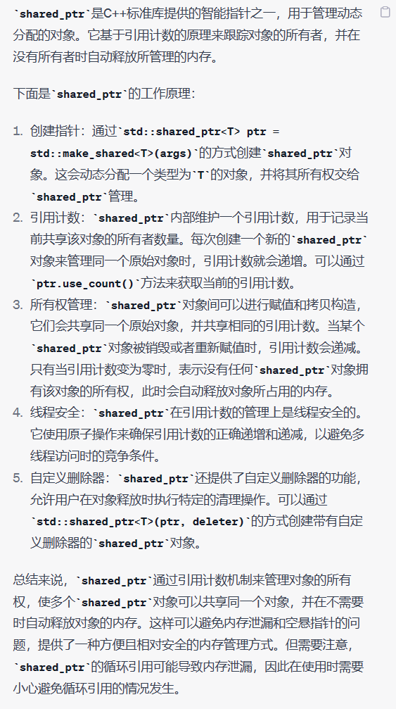

# Note

## other1

## 14 在资源管理类中小心 *copying* 行为

有时需要自定义资源管理类，使资源在构造期间获得，在析构期间释放。

```cpp
void lock(Mutex* pm); //锁定pm所指的互斥器
void unlock(Mutex* pm); //将互斥器解除锁定
class Lock {
public:
	explicit Lock(Mutex* pm): mutexPtr(pm) { lock(mutexPtr); }
	~Lock() { unlock(mutexPtr); }
private:
	Mutex *mutexPtr;
};
```

这里当对象被复制时常常会发生问题
解决方法：

- 禁止复制，将 *copying* 操作声明为 private，见[条款6](https://github.com/yuedaokong/Effective-Cpp-Learing/tree/main/Constructs,%20Destructs,%20and%20Assignment%20Operators/06)

- 对底层资源使用 “引用计数法”，将 mutexPtr 类型改为 `tr1::shared_ptr<Mutex>`，并为其指定删除器 ( deleter ) 。无需声明析构，默认的析构函数会在互斥器引用次数为0时自动调用 tr1::shared_ptr 的删除器。

  ```cpp
  class Lock {
  public:
  	explicit Lock(Mutex* pm): mutexPtr(pm,unlock) //指定unlock为删除器
  	{
  		lock(mutexPtr.get()); //获得shared_ptr的原始指针
  	} 
  private:
  	std::tr1::shared_ptr<Mutex> mutexPtr;
  };
  ```

- 复制底层资源，复制多份副本，当不需要某个副本时，确保被释放。在此情况下复制资源管理对象，应该同时也复制其所包含的资源，即 “深度拷贝” 。

- 转移底部资源的拥有权，将资源拥有权从被复制对象转移到目标物，类似 auto_ptr 的做法。

## other2

**14. 在资源管理类中小心copying行为 （Think carefully about copying behavior in resource-managing classes)**

在资源管理类里面，如果出现了拷贝复制行为的话，需要注意这个复制具体的含义，从而保证和我们想要的效果一样

思考下面代码在复制中会发生什么：
    

    class Lock{
    public:
        explicit Lock(Mutex *pm):mutexPtr(pm){
            lock(mutexPtr);//获得资源锁
        }
        ~Lock(){unlock(mutexPtr);}//释放资源锁
    private:
        Mutex *mutexPtr;
    }
    Lock m1(&m)//锁定m
    Lock m2(m1);//好像是锁定m1这个锁。。而我们想要的是除了复制资源管理对象以外，还想复制它所包括的资源（deep copy）。通过使用shared_ptr可以有效避免这种情况。

需要注意的是：copy函数有可能是编译器自动创建出来的，所以在使用的时候，一定要注意自动生成的函数是否符合我们的期望

总结;

+ 复制RAII对象（Resource Acquisition Is Initialization）必须一并复制他所管理的资源（deep copy）
+ 普通的RAII做法是：禁止拷贝，使用引用计数方法


## shared_ptr可以指定删除器



# Book


