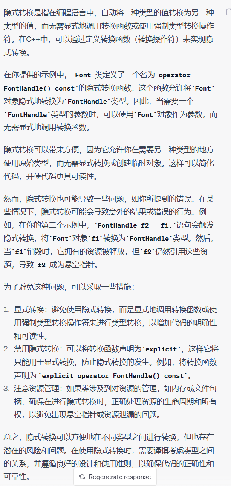
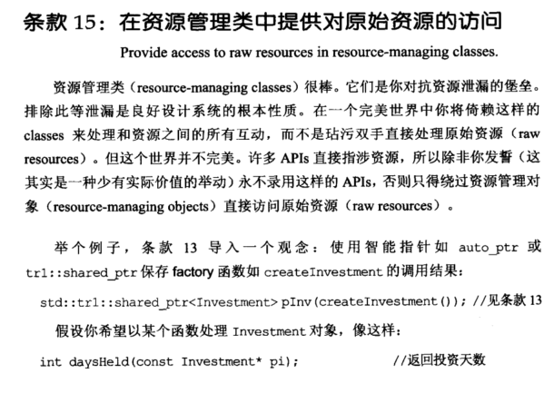
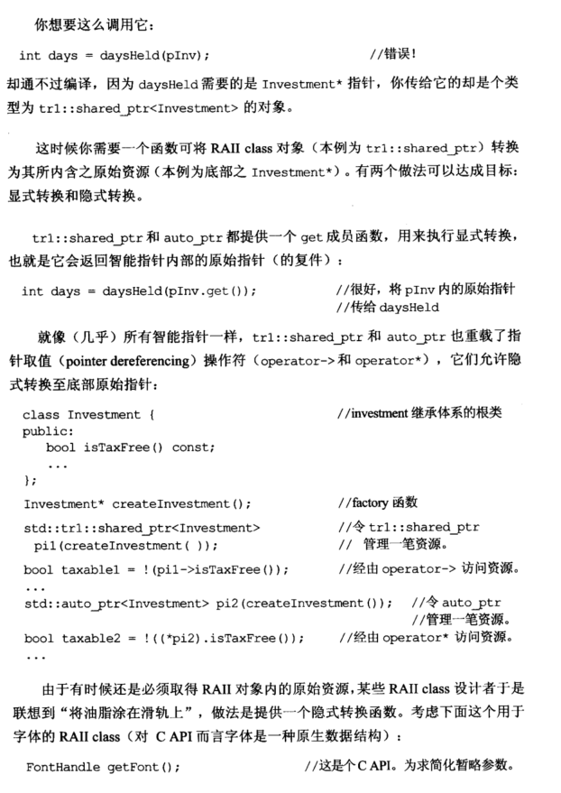
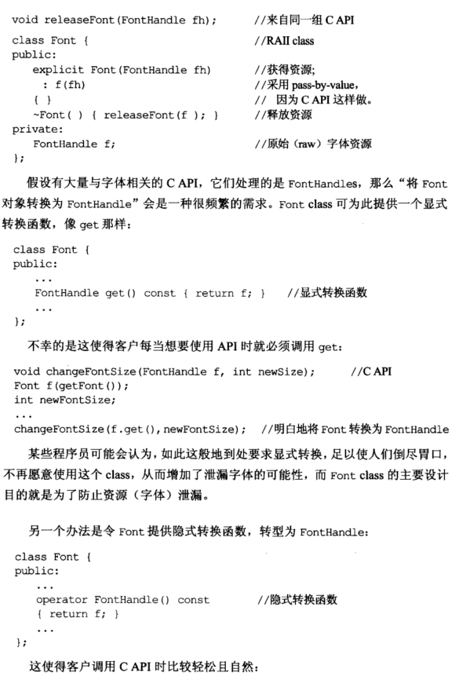
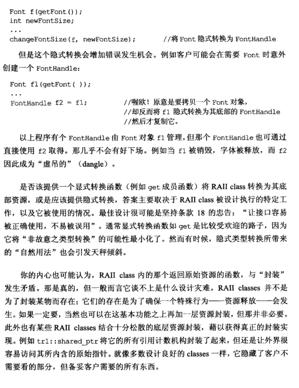
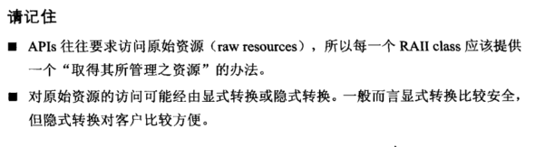

# Note

## other1

## 15 在资源管理类中提供对原始资源的访问

APIs 往往要求访问原始资源，所以每个 RAII ( *Resource Acquisition Is Initialization* ) class 应该提供一个取得其所管理资源的方法。

### 为使用智能指针的 RAII class 提供对原始资源的访问

- 显式转换

  

  ==需要一个Investment* 指针，而不是std::shared_ptr类型的的对象==

  ```cpp
  std::tr1::shared_ptr<Investment> pInv(createInvestment());
  int daysHeld(const Investment* pi);
  //int days = daysHeld(pInv); //错误，类型不匹配
  int days = daysHeld(pInv.get()); //提供get函数显式获得pInv内的原始指针
  ```

- 隐式转换 

  ```cpp
  class Investment {
  public:
  	bool isTaxFree() const;
  	...
  };
  std::tr1::shared_ptr<Investment> pi1(createInvestment());
  bool taxablel = !(pi1->isTaxFree()); //通过智能指针中重载的operator->访问资源
  ...
  std::tr1::shared_ptr<Investment> pi2(createInvestment());
  bool taxablel = !((*pi1).isTaxFree()); //通过智能指针中重载的operator*访问资源
  ...
  ```

### 为自定义的 RAII class 提供对原始资源的访问

- 显式转换，提供一个类似 get 的显式转换函数

  ```cpp
  FontHandle getFont();
  void releaseFont(FontHandle fh);
  class Font {
  public:
  	...
  	FontHandle get() const { return f; } //显式转换函数
  	...
  };
  void changeFontSize(FontHandle f, int newSize);
  Font f(getFont());
  int newFontSize;
  ...
  changeFontSize(f.get(), newFontSize); //显式的将Font转换为FontHandle
  ```

- 隐式转换

  ```cpp
  class Font {
  public:
  	...
  	operator FontHandle() const { return f; } //隐式转换函数
  	...
  };
  void changeFontSize(FontHandle f, int newSize);
  Font f(getFont());
  int newFontSize;
  ...
  changeFontSize(f, newFontSize); //隐式的将Font转换为FontHandle
  ```

  但隐式转换会增加错误发生的机会，例如：

  ```cpp
  Font f1(getFont());
  ...
  FontHandle f2 = f1; //本来要拷贝Font对象，现被隐式转换为FontHandle
                      //这样当销毁f1后Font被释放，而f2成为虚吊的（dangle）
  ```

对原始资源的访问可能经由显式或隐式转换，一般而言显式转换更为安全，但隐式转换用户实验更加方便。

## other2

**15. 在资源管理类中提供对原始资源的访问（Provide access to raw resources in resource-managing classes)**

例如：shared_ptr<>.get()这样的方法，或者->和*方法来进行取值。但是这样的方法可能稍微有些麻烦，有些人会使用一个隐式转换，但是经常会出错：
    

    class Font; class FontHandle;
    void changeFontSize(FontHandle f, int newSize){    }//需要调用的API
    
    Font f(getFont());
    int newFontSize = 3;
    changeFontSize(f.get(), newFontSize);//显式的将Font转换成FontHandle
    
    class Font{
        operator FontHandle()const { return f; }//隐式转换定义
    }
    changeFontSize(f, newFontSize)//隐式的将Font转换成FontHandle
    但是容易出错，例如
    Font f1(getFont());
    FontHandle f2 = f1;就会把Font对象换成了FontHandle才能复制

总结：

+ 每一个资源管理类RAII都应该有一个直接获得资源的方法
+ 隐式转换对客户比较方便，显式转换比较安全，具体看需求


## 隐式转换




# Book









