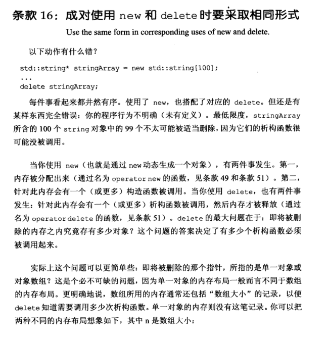
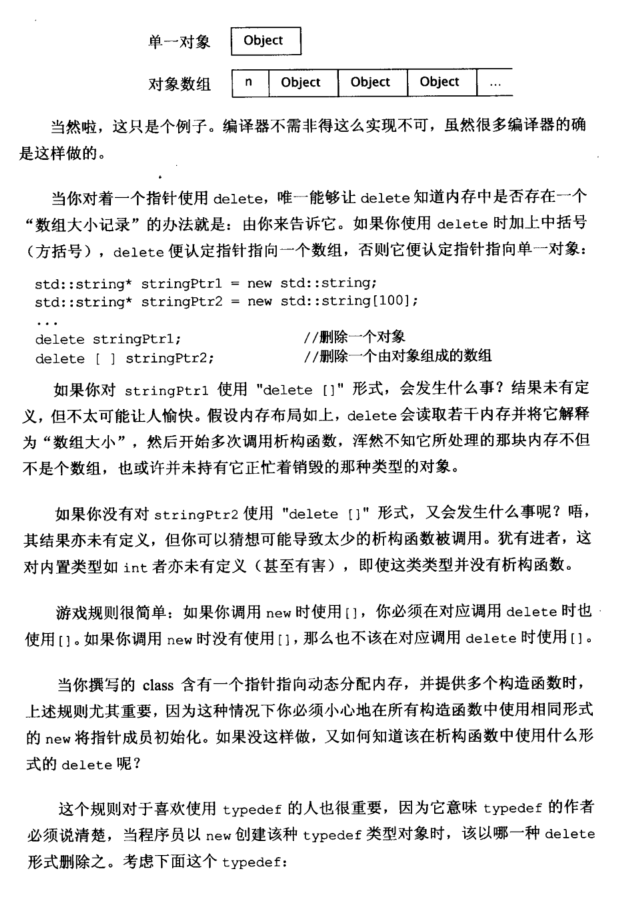
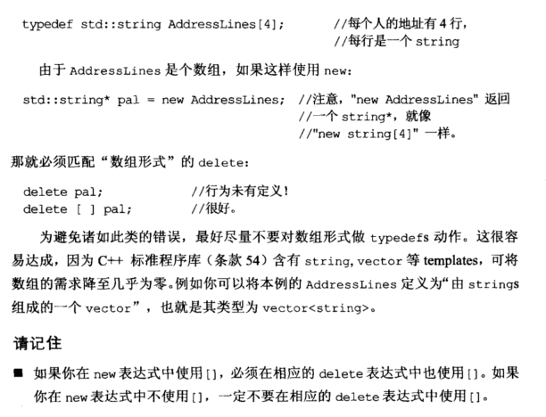

# Note

## other1

## 16 成对使用 new 和 delete 时要采用相同形式

调用 new 时使用 [ ]，则调用 delete 时也要使用 [ ]。

```cpp
std::string* stringPtr1 = new std::string;
std::string* stringPtr2 = new std::string[100];
...
delete stringPtr1;    //删除一个对象
delete [] stringPtr2; //删除一个由对象组成的数组
```

==注意 当使用 typedef 时，也要保持 new 和 delete 成对使用。==

### 下面这个typedef也要好好了解一下

```cpp
typedef std::string AddressLines[4];
std::string* pal = new AddressLines; //这里相当于sting[4]
//delete pal; //错误匹配
delete [ ] pal;
```

故最好不要用 typedefs 定义数组。

## other2

**16. 成对使用new和delete时要采取相同形式 （Use the same form in corresponding uses of new and delete)**

总结：

+ 即： 使用new[]的时候要使用delete[], 使用new的时候一定不要使用delete[]

# Book





