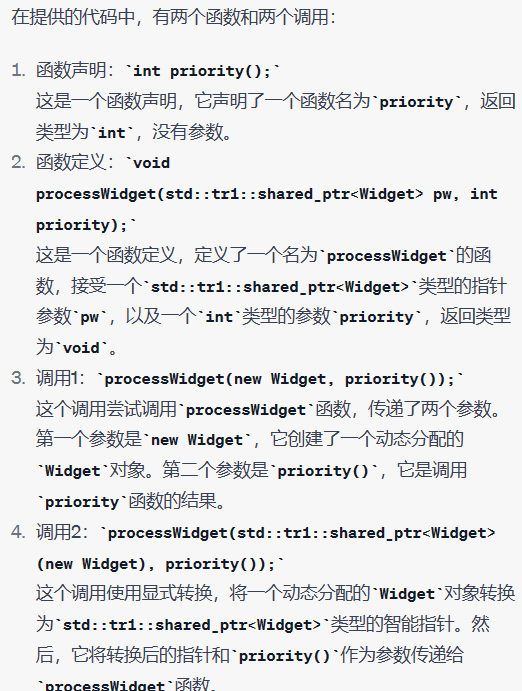
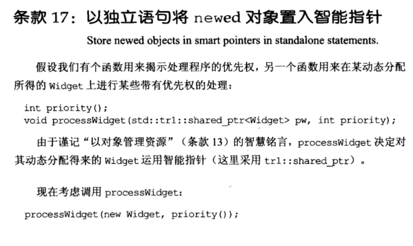
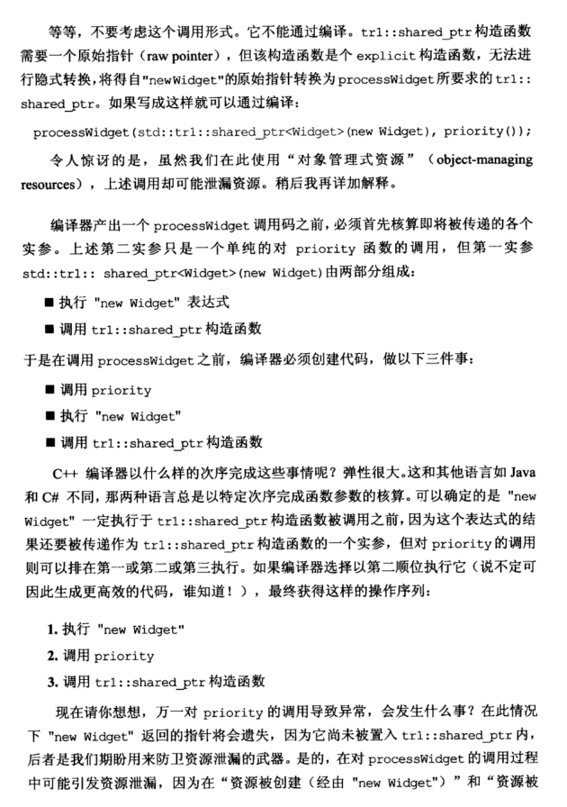
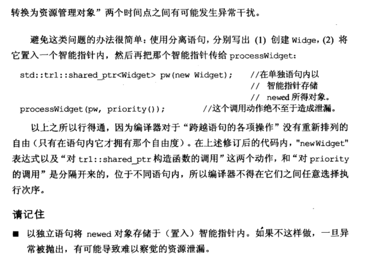

# Note

## other1

## 17 以独立语句将 newed 对象置入智能指针

### 显示转换创建智能指针

```cpp
int priority();
void processWidget(std::tr1::shared_ptr<Widget> pw, int priority);
//tr1::shared_ptr的构造函数是explicit构造函数，无法进行隐式转换
//processWidget(new Widget, priority()); 
//显式转换
proccessWidget(std::tr1::shared_ptr<Widget>(new Widget), priority());
```




上诉形式可能造成资源泄露，如果执行 new Widget 后，执行 priority()的调用出现异常，则不会调用 tr1::shared_ptr 的构造函数，new Widget 的指针就不会调用 tr1::shared_ptr 的析构进行销毁。

要避免这种问题出现，只需将语句分离。

### 分开写

```cpp
std::tr1::shared_ptr<Widget> pw(new Widget); //智能指针存储newed对象
proccessWidget(pw, priority()); //在调用函数，就不会发生泄露
```

## other2

**17. 以独立语句将new的对象置入智能指针 （Store newed objects in smart pointers in standalone statements)**

主要是会造成内存泄漏，考虑下面的代码：
    

```cpp
int priority();
void processWidget(shared_ptr<Widget> pw, int priority);
processWidget(new Widget, priority());// 错误，这里函数是explicit的，不允许隐式转换（shared_ptr需要给他一个普通的原始指针
processWidget(shared_ptr<Widget>(new Widget), priority()) // 可能会造成内存泄漏

内存泄漏的原因为：先执行new Widget，再调用priority， 最后执行shared_ptr构造函数，那么当priority的调用发生异常的时候，new Widget返回的指针就会丢失了。当然不同编译器对上面这个代码的执行顺序不一样。所以安全的做法是：

shared_ptr<Widget> pw(new Widget)
processWidget(pw, priority())
```

总结：

+ 凡是有new语句的，尽量放在单独的语句当中，特别是当使用new出来的对象放到智能指针里面的时候

# Book





