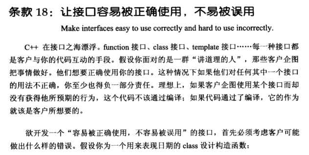
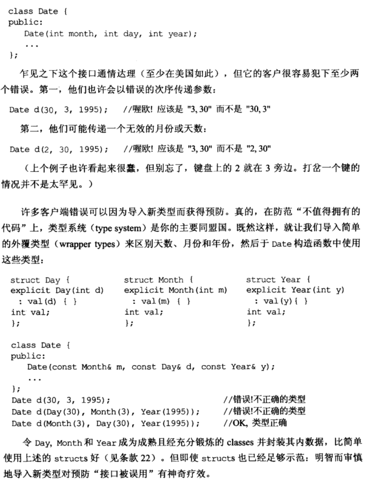
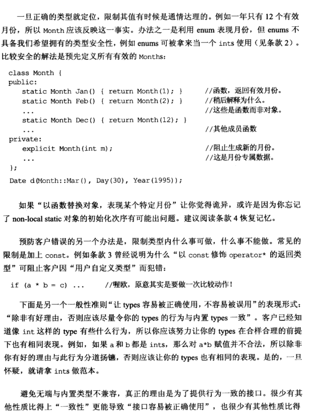
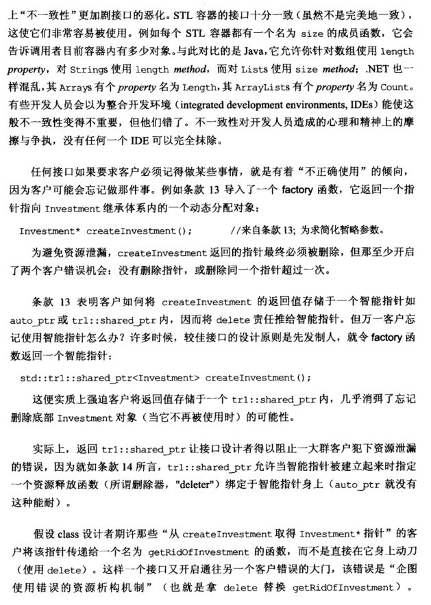
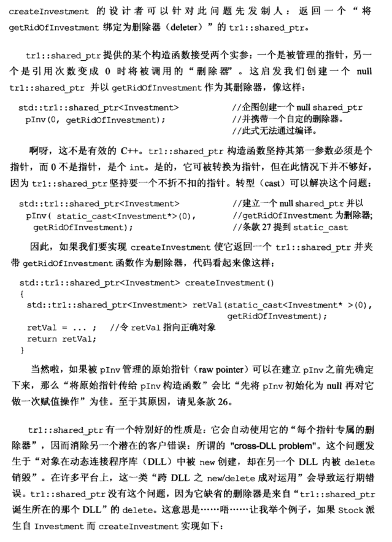
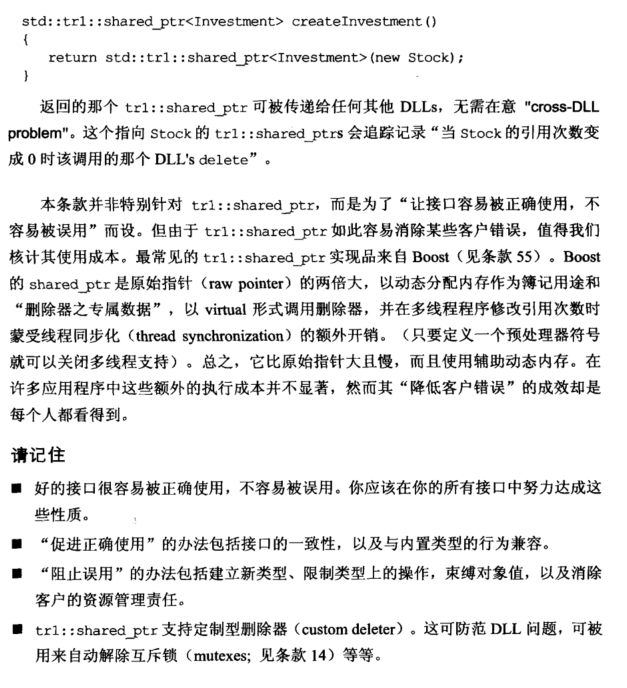

# Note

## other1

#### 四、设计与声明 (Designs and Declarations)

**18. 让接口容易被正确使用，不易被误用  （Make interfaces easy to use correctly and hard to use incorrectly)**

要思考用户有可能做出什么样子的错误，考虑下面的代码：
    

```cpp
Date(int month, int day, int year);
这一段代码可以有很多问题，例如用户将day和month顺序写反（因为三个参数都是int类型的），可以修改成：
Date(const Month &m, const Day &d, const Year &y);//注意这里将每一个类型的数据单独设计成一个类，同时加上const限定符
为了让接口更加易用，可以对month加以限制，只有12个月份
class Month{
    public:
    static Month Jan(){return Month(1);}//这里用函数代替对象，主要是方式第四条：non-local static对象的初始化顺序问题
}

而对于一些返回指针的问题函数，例如：
Investment *createInvestment();//智能指针可以防止用户忘记delete返回的指针或者delete两次指针，但是可能存在用户忘记使用智能指针的情况，那么方法：
std::shared_ptr<Investment> createInvestment();就可以强制用户使用智能指针，或者更好的方法是另外设计一个函数：
std::shared_ptr<Investment>pInv(0, get)
```

总结：

+ “促进正确使用”的办法包括接口的一致性，以及与内置类型的行为兼容
+ “阻止误用”的办法包括建立新类型、限制类型上的操作，束缚对象值，以及消除客户的资源管理责任
+ shared_ptr支持定制删除器，从而防范dll问题，可以用来解除互斥锁等

## other2


# Book











