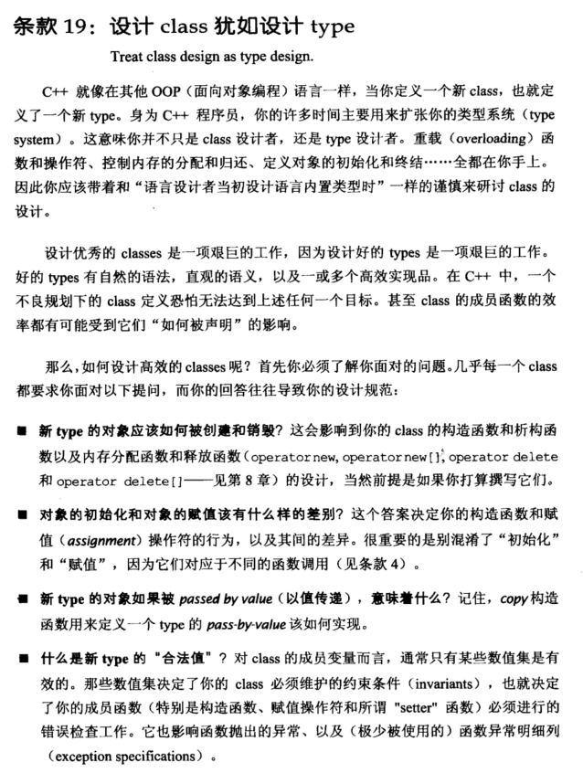
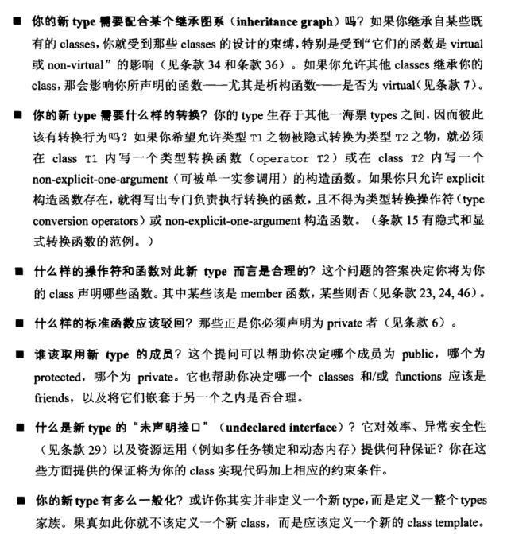
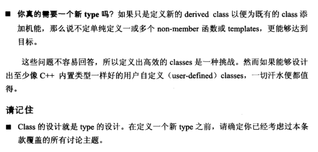

# Note

## other1

## 19 设计 class 犹如设计 type

设计 class 需考虑的工作

- 构造函数和析构函数的编写，负责创建与销毁
- 构造函数与赋值函数的差别
- 拷贝构造函数的实现
- 进行错误检查，抛出异常
- 继承自一个基类，要考虑受到的约束 virtual 或 non-virtual 的影响；自身作为基类，考虑声明的函数，[尤其是析构函数，是否为 virtual](https://github.com/yuedaokong/Effective-Cpp-Learing/tree/main/Constructs,%20Destructs,%20and%20Assignment%20Operators/07)
- 与其他 types 之间的转换，[隐式转换的编写](https://github.com/yuedaokong/Effective-Cpp-Learing/tree/main/Resource%20Management/15)
- 类内该声明那些函数和操作符
- [不需要哪些默认函数，要声明为 private](https://github.com/yuedaokong/Effective-Cpp-Learing/tree/main/Constructs,%20Destructs,%20and%20Assignment%20Operators/06)
- 成员函数权限 (public/private/protected)，友元函数和类
- 条款29
- 范式编程模板化
- 是否可以在其他类的基础上添加，不需新建一个类

## other2

**19. 设计class犹如设计type  （Treat class design as type design)**

如何设计class：

+ 新的class对象应该被如何创建和构造
+ 对象的初始化和赋值应该有什么样的差别（不同的函数调用，构造函数和赋值操作符）
+ 新的class如果被pass by value（以值传递），意味着什么（copy构造函数）
+ 什么是新type的“合法值”（成员变量通常只有某些数值是有效的，这些值决定了class必须维护的约束条件）
+ 新的class需要配合某个继承图系么（会受到继承类的约束）
+ 新的class需要什么样的转换（和其他类型的类型变换）
+ 什么样的操作符和函数对于此type而言是合理的（决定声明哪些函数，哪些是成员函数）
+ 什么样的函数必须为private的 
+ 新的class是否还有相似的其他class，如果是的话就应该定义一个class template
+ 你真的需要一个新type么？如果只是定义新的derived class或者为原来的class添加功能，说不定定义non-member函数或者templates更好

# Book

