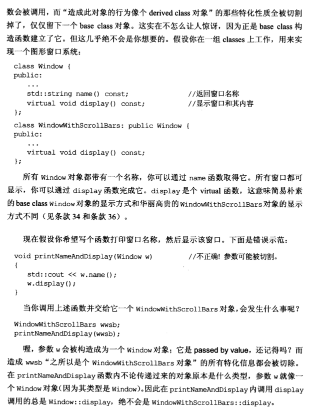

# Note

## other1

## 20 宁以 pass-by-reference-to-const 替换 pass-by-value

1. 以 pass-by-value 的方式会调用多次构造函数、析构函数，非常费时费资源。通过 pass-by-reference-to-const 的方式，效率就会高很多，没有任何构造和析构函数被调用，因为没有任何新对象被创建。const 十分重要，由于 pass-by-value 的方式不会改变传入值，只会改变其副本值，不用添加 const；而 pass-by-reference 的方式会改变传入值，要添加 const。

2. 以 by-reference 方式传递参数还可避免 *slicing*（对象切割）问题。

  ```cpp
class Window {
public:
  ...
  std::string name() const;           //返回窗口名
  virtual void display() const;       //显式窗口和其内容 
};
class WindowWithScrollBars: public Window {
public:
  ...
  virtual void display() const;
};
void printNameAndDisplay(Window w)          //不正确！参数可能被切割
{
  std::cout << w.name();
  w.display();
}
WindowWithScrollBars wwsb;
printNameAndDisplay(wwsb);
  ```

    上述程序，wwsb 在调用 printNameAndDisplay 函数时，w 为 Window 类型，不论传入什么类型，display 始终调用 Window::display，
    发生对象切割。
    
    以 by -reference-to-const 的方式，可避免对象切割。

  ```cpp
void printNameAndDisplay(const Window& w)
{
  std::cout << w.name();
  w.dispaly(); 
}
  ```

3. 可选择 pass-by-value 的唯一对象就是内置类型和 STL 的迭代器和函数对象，其他尽量选用 pass-by-reference-to-const 替换 pass-by-value。


## other2

**20. 以pass-by-reference-to-const替换pass-by-value  （Prefer pass-by-reference-to-const to pass-by-value)**

主要是可以提高效率，同时可以避免基类和子类的参数切割问题
    

```cpp
bool validateStudent(const Student &s);//省了很多构造析构拷贝赋值操作
bool validateStudent(s);

subStudent s;
validateStudent(s);//调用后,则在validateStudent函数内部实际上是一个student类型，如果有重载操作的话会出现问题
```

对于STL等内置类型，还是以值传递好一些

# Book





