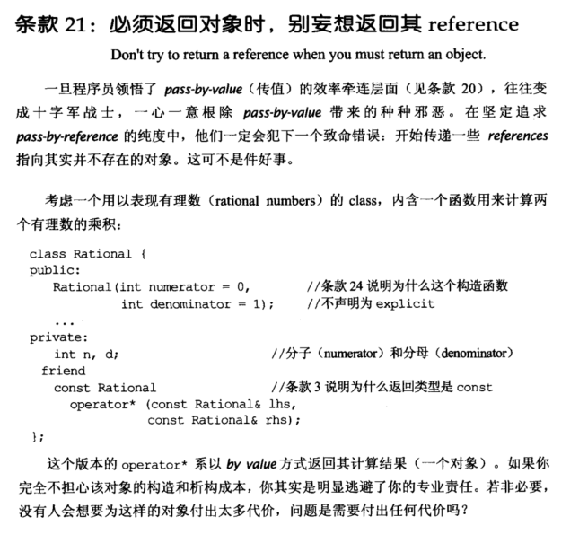
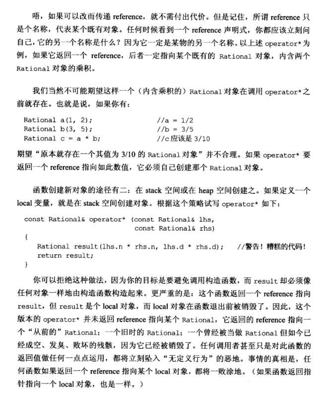
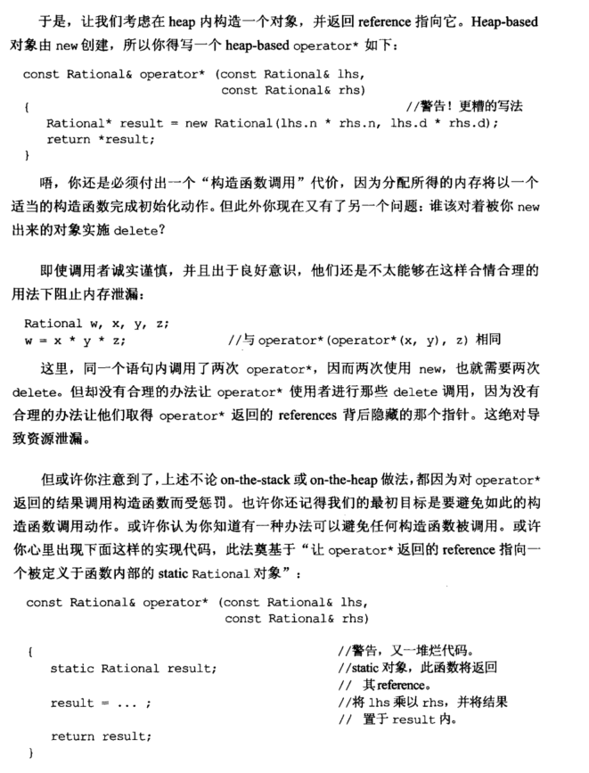
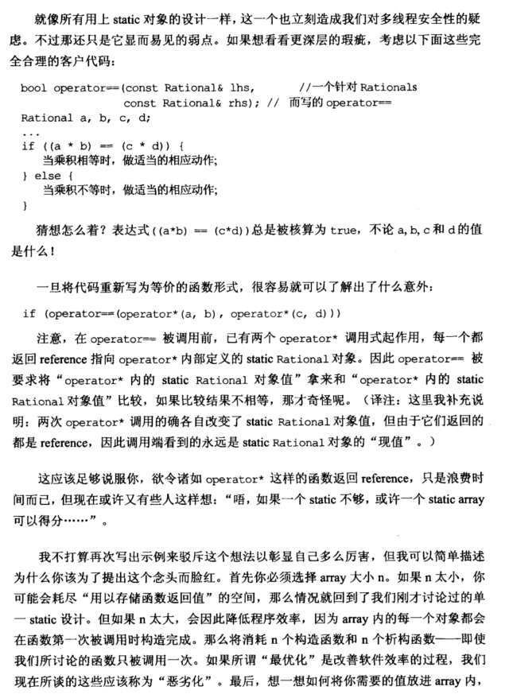
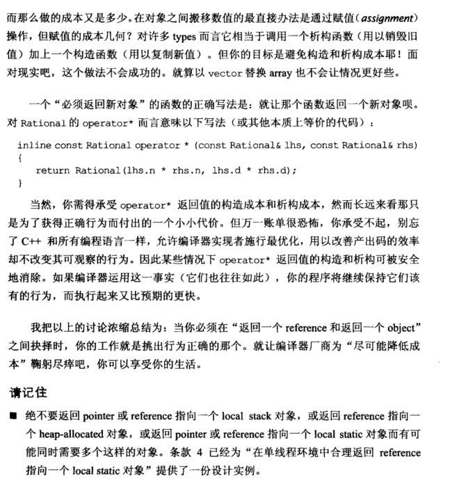

# Note

## other1

## 21 必须返回对象时，别妄想返回其 reference

在[了解 pass-by-reference 的高效](https://github.com/yuedaokong/Effective-Cpp-Learing/tree/main/Designs%20and%20Declarations/20)后，可能会在不恰当的时候使用，开始传递一些 references 指向其实并不存在的值。

```cpp
class Rational {
public:
	Rational(int numerator = 0, int denominator = 1);
	...
private:
	int n, d; //分子n，分母d
friend const Rational
	operator*(const Rational& lhs, const Rational& rhs);
};
```

如改用 reference 作为返回值，还是调用了构造函数，更严重的是函数返回值 reference 指向 result，==但其作为一个 local 对象，在获取返回值之前已被销毁。==

```cpp
const Rational& operator*(const Rational& lhs, const Rational& rhs)
{
	Rational result(lhs.n * rhs.n, lhs.d * rhs.d); 
	return result; 
}
```

如改用在 heap 中构造一个对象，还是调用了构造函数，==并且 delete 的次数，要和 operator* 调用次数保持一致，delete 无法确定==。

```cpp
const Rational& operator*(const Rational& lhs, const Rational& rhs)
{
	Rational* result = new Rational(lhs.n * rhs.n, lhs.d * rhs.d); 
	return *result; 
}
```

如改用 static 对象，会立刻造成对多线程安全性的疑虑，此外
`if (operator==(operator*(a, b), operator*(c, d)))`，其始终为 true，reference 指向现值。


总结，绝不要返回 pointer 或 reference 指向一个 local stack 对象，或返回 reference 指向一个 heap-allocated 对象，或返回 pointer 或 reference 指向一个 local static 对象而有可能同时需要多个这样的对象。

## other2

**21. 必须返回对象时，别妄想返回其reference  （Don't try to return a reference when you must return an object)**

主要是很容易返回一个已经销毁的局部变量，如果想要在堆上用new创建的话，则用户无法delete，如果想要在全局空间用static的话，也会出现大量问题,==所以正确的写法是：==

```cpp
inline const Rational operator * (const Rational &lhs, const Rational &rhs){
    return Rational(lhs.n * rhs.n, lhs.d * rhs.d);
}
```

==当然这样写的代价就是成本太高，效率会比较低==

# Book










