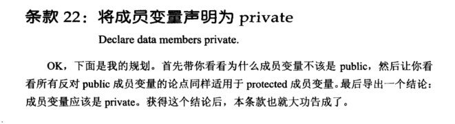
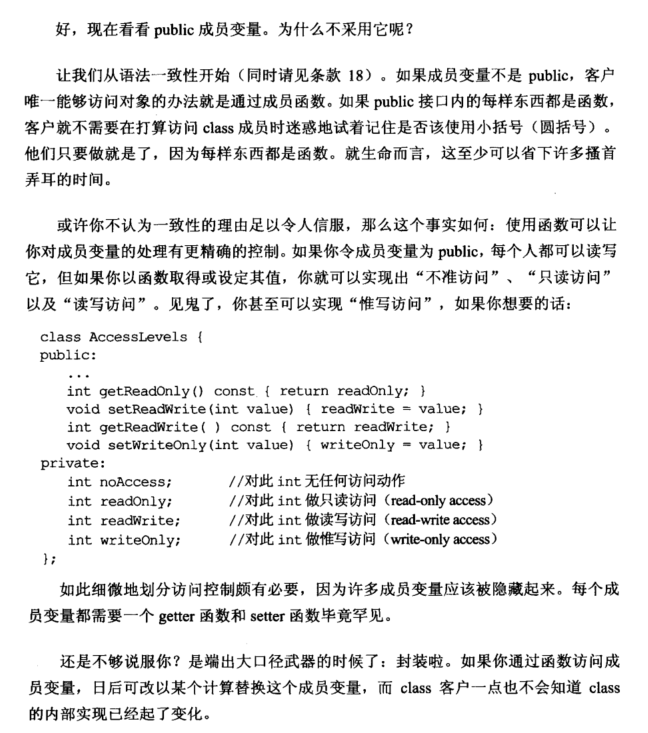
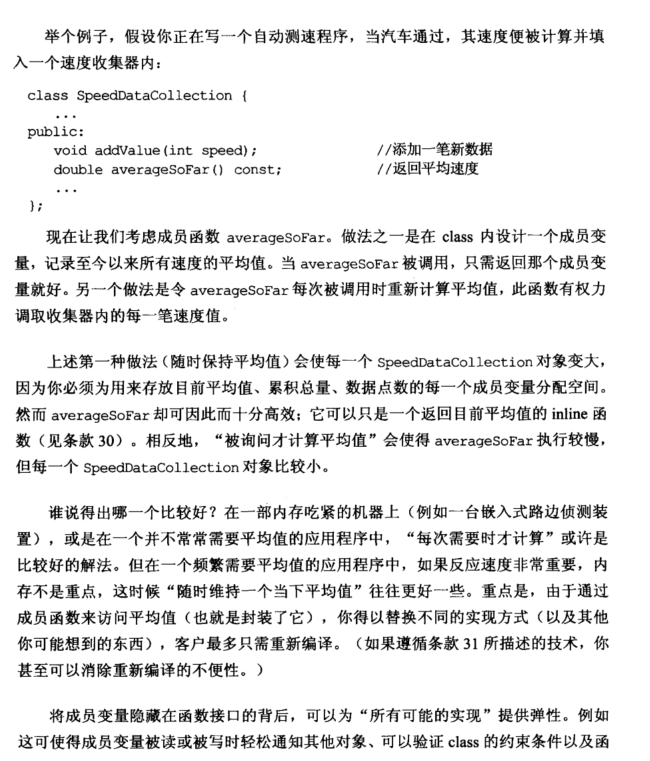
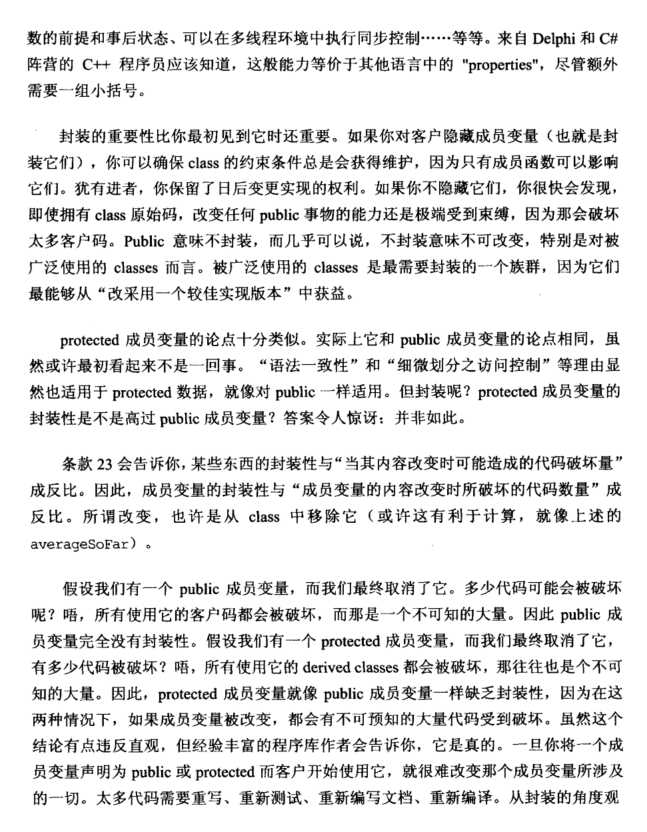
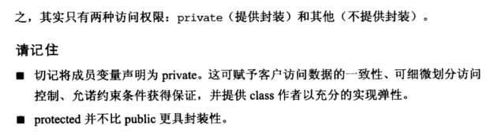

# Note

## other1

## 22 将成员变量声明为 private

1. 成员变量为 private，客户唯一能够访问对象的办法就是通过成员函数，方便用户使用。

2. 使用成员函数可以对成员变量进行更精确的控制。

   ```cpp
   class AccessLevels {
   public:
   	...
   	int getReadOnly() const { return readOnly; }
   	void setReadWrite(int val) { readWrite = val; }
   	int getReadWrite() const { return readWrite; }
   	void setWriteOnly(int val) { writeOnly = val; }
   private:
   	int noAccess;     //无任何访问操作
   	int readOnly;     //只读
   	int readWrite;    //读写
   	int writeOnly;    //惟写
   };
   ```

3. 可将程序封装，便于修改，[某些东西的封装性与 “当其内容改变时可能造成的代码破坏量” 成反比](https://github.com/yuedaokong/Effective-Cpp-Learing/tree/main/Designs%20and%20Declarations/23)。从封装的角度看，只有两种访问权限: private（提供封装）和其他（不提供封装），因为 protected 并不比 public 更具封装性，protected 成员变量消失，所有使用它的 derived classes 都会被破坏，同样需要大量代码重写、测试、编译。

## other2

**22. 将成员变量声明为private  （Declare data members private)**

应该将成员变量弄成private，然后用过public的成员函数来访问他们，这种方法的好处在于可以更精准的控制成员变量，包括控制读写，只读访问等。

同时，如果public的变量发生了改变，如果这个变量在代码中广泛使用，那么将会有很多代码遭到了破坏，需要重新写

另外protected 并不比public更具有封装性，因为protected的变量，在发生改变的时候，他的子类代码也会受到破坏

# Book









