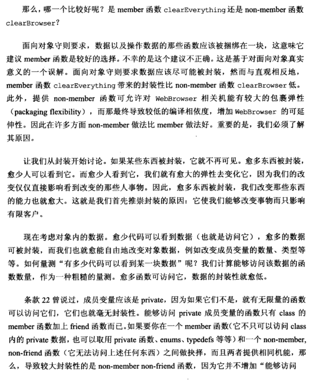

# Note

## other1

## 23 宁以 non-number、non-friend 替换 member 函数

```cpp
class WebBrowser {
public:
	...
	//member函数调用clearCache,clearHistroy,removeCookies
	//void clearEverything();  
	void clearCache();
	void clearHistroy();
	void removeCookies();
};
//non-member函数调用clearCache,clearHistroy,removeCookies
void clearBrowser(WebBrowser& wb) 
{
	wb.clearCache();
	wb.clearHistory();
	wb.removeCookies();
}
```

non-member 比 member 函数好的原因

由于封装性，越多的东西被封装，越少的人可以看到它，就有越大的弹性去改变它。进而，某一块封装的数据，有越多的函数可访问它，数据的封装性就越低。因此，non-member、non-friend 比 member 函数可访问的数据量少，封装性更好。

注：

1. friend 函数对 class private  成员的访问权力和 member 函数相同，因此从封装的角度看，是在 member 和 non-member、non-friend 之间做选择。
2. non-member 函数可以是另一个 class 的 member 函数

## other2

**23. 以non-member、non-friend替换member函数  （Prefer non-member non-friend functions to member functions)**

区别如下：
    

```cpp
class WebBrowser{
    public:
    void clearCache();
    void clearHistory();
    void removeCookies();
}

member 函数：
class WebBrowser{
    public:
    ......
    void clearEverything(){ clearCache(); clearHistory();removeCookies();}
}

non-member non-friend函数：
void clearBrowser(WebBrowser& wb){
    wb.clearCache();
    wb.clearHistory();
    wb.removeCookies();
}
```

这里的原因是：member可以访问class的private函数，enums，typedefs等，但是non-member函数则无法访问上面这些东西，所以non-member non-friend函数更好

这里还提到了namespace的用法，namespace可以用来对某些便利函数进行分割，将同一个命名空间中的不同类型的方法放到不同文件中(这也是C++标准库的组织方式，例如：
    

```cpp
"webbrowser.h"
namespace WebBrowserStuff{
    class WebBrowser{...};
    //所有用户需要的non-member函数
}

"webbrowserbookmarks.h"
namespace WebBrowserStuff{
    //所有与书签相关的便利函数
}
```


# Book





