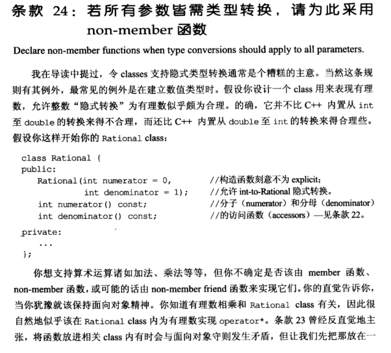
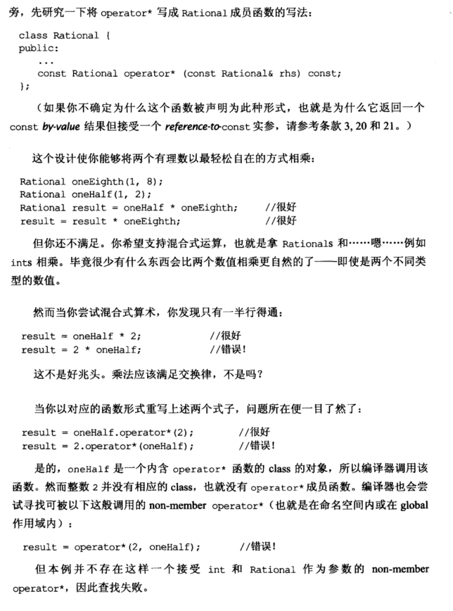
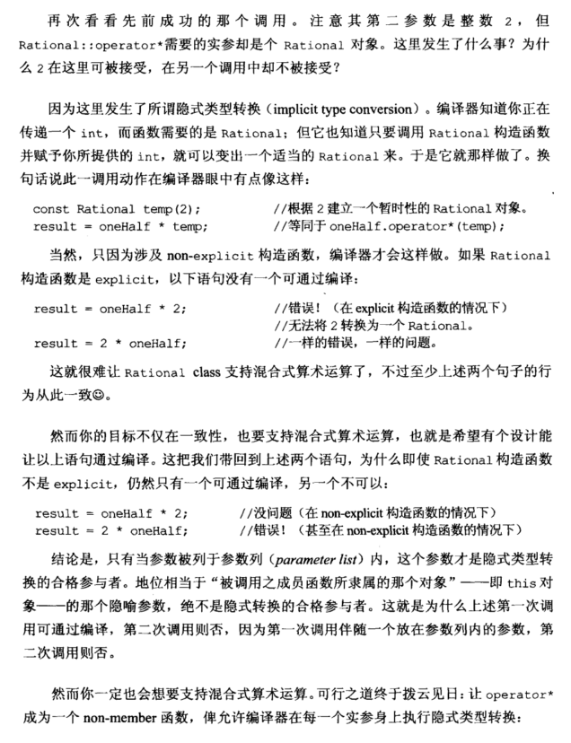
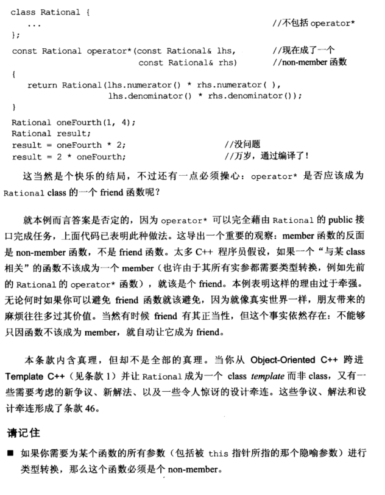

# Note

## other1

## 24 若所有参数皆需类型转换，请以此采用 non-member 函数

```cpp
class Rational {
public:
	//不声明为explicit，允许int-to-Rational隐式转换
	Rational(int numerator = 0, int denominator = 1); 
	int numerator() const;
	int denominator() const;
	//operator* 写成 Rational 成员函数
	const Rational operator* (const Rational& rhs) const;
private:
	...
};

Rational oneEighth(1, 8);
Rational oneHalf(1, 2);
Rational result = oneHalf * oneEighth; //正确
result = result * oneEighth;           //正确
result = oneHalf * 2;                  //正确
result = 2 * oneHalf;                  //错误
```

以函数形式表示

```cpp
result = oneHalf.operator*(2);         //正确
result = 2.operator*(onHalf);          //错误
```

由于 2 在前时，未在 operator* 函数的参数列表内，不能进行隐式转换。

改善方法，将 operator* 函数改为 non-member 函数

```cpp
class Rational { ... };
const Rational operator* (const Rational& lhs, const Rational& rhs)
{
	return Rational(lhs.numerator() * rhs.numerator(),
					lhs.denominator() * rhs.denominator());
}
```

注：无论何时可以避免 friend 函数就该避免，不能够只因函数不该成为 member，就自动让它成为 friend。

## other2

**24. 若所有参数皆需类型转换，请为此采用non-member函数  （Declare non-member functions when type conversions should apply to all parameters)**

例如想要将一个int类型变量和Rational变量做乘法，如果是成员函数的话，发生隐式转换的时候会因为不存在int到Rational的类型变换而出错：


```cpp
class Rational{
    public:
    const Rational operator* (const Rational& rhs)const;
}
Rational oneHalf;
result = oneHalf * 2;
result = 2 * oneHalf;//出错，因为没有int转Rational函数

non-member函数
class Rational{}
const Rational operator*(const Rational& lhs, const Rational& rhs){}
```


# Book







