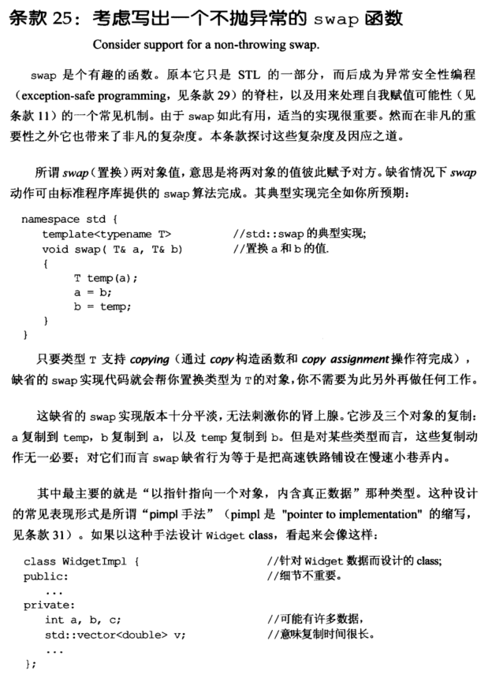
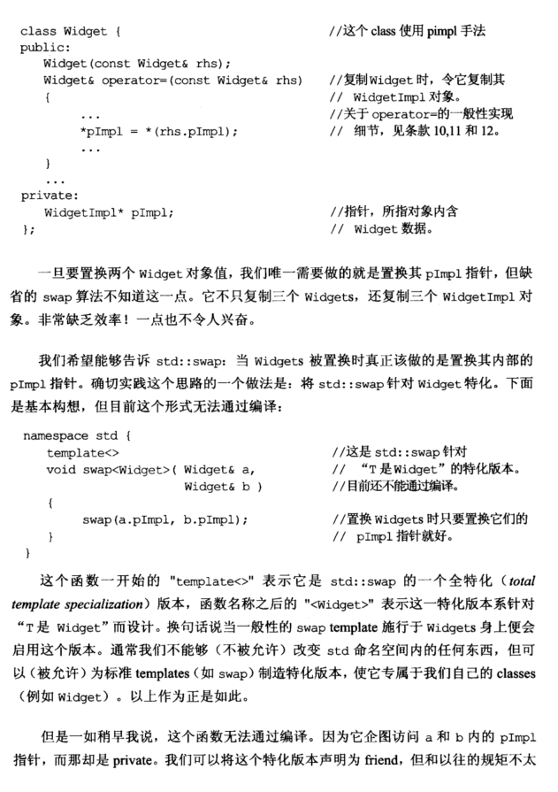
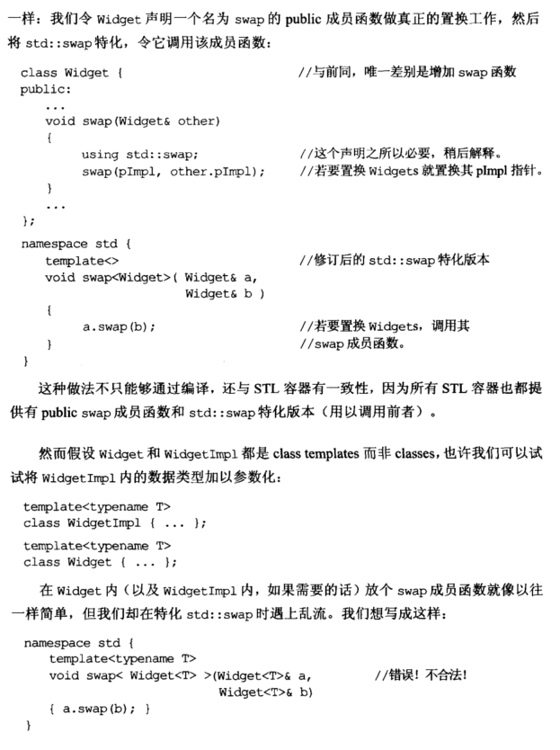
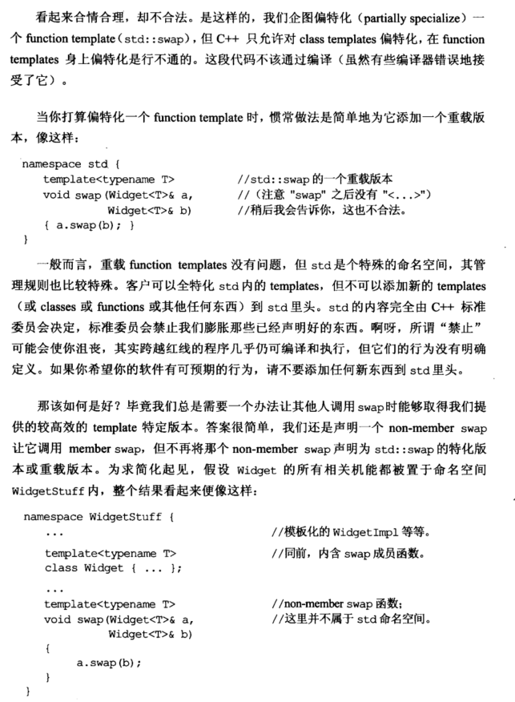
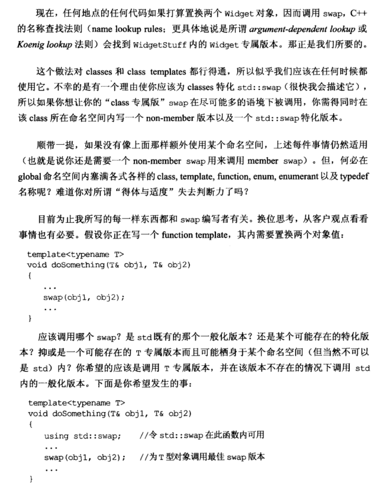
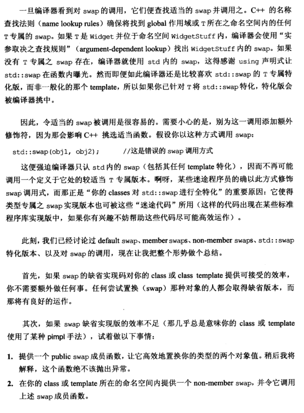
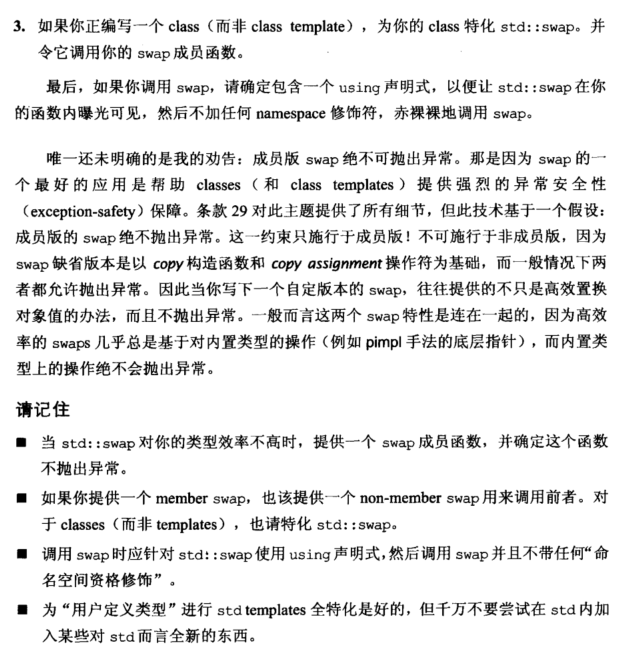

# Note

## other1

**25. 考虑写出一个不抛异常的swap函数  （Consider support for a non-throwing swap)**

写出一个高效、不容易发生误会、拥有一致性的swap是比较困难的，下面是对比代码：

```cpp
修改前代码：
class Widget{
    public:
    Widget& operator=(const Widget& rhs){
        *pImpl = *(rhs.pImpl);//低效
    }
    private:
    WidgetImpl* pImpl;
}

修改后代码：
namespace WidgetStuff{
    template<typename T>
    class Widget{
        void swap(Widget& other){
            using std::swap;      //此声明是std::swap的一个特例化，
            swap(pImpl, other.pImpl);
        }
    };
    ...
    template<typename T>           //non-member swap函数
    void swap(Widget<T>& a, Widget<T>& b){//这里并不属于 std命名空间
        a.swap(b);
    }    
}
```

总结：

+ 当std::swap对我们的类型效率不高的时候，应该提供一个swap成员函数，且保证这个函数不抛出异常（因为swap是要帮助class提供强烈的异常安全性的）
+ 如果提供了一个member swap，也应该提供一个non-member swap调用前者，对于classes（而不是templates），需要特例化一个std::swap
+ 调用swap时应该针对std::swap使用using std::swap声明，然后调用swap并且不带任何命名空间修饰符
+ 不要再std内加对于std而言是全新的东西（不符合C++标准）

## other2


# Book













