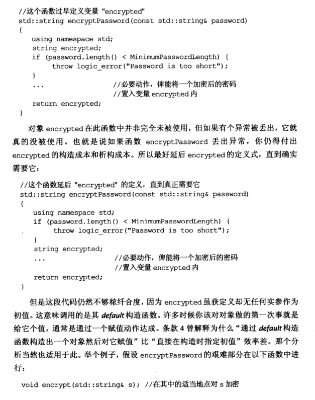
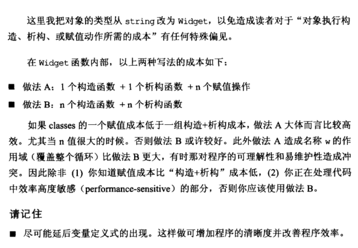

# Note

# other1

## 26 尽可能延后变量定义式的出现时间

```cpp
//这个函数过早的定义变量”encrypted“
void encrypt(std::string& s); //在其中的适当位置对s加密
std::string encryptPassword(const std::string& password)
{
	using namespace std;
	string encrypted;
	if (password.length() < MinimumPasswordLength) {
		throw logic_error("Password is too short");
	}
	...
	return encrypted;
}
```

如果抛出 logic_error，则 encrypted 完全未被使用，还需付出构造和析构的成本。所以最好延后 encrypted 的定义式，直到确实需要它。

```cpp
void encrypt(std::string& s); //在其中的适当位置对s加密
std::string encryptPassword(const std::string& password)
{
	...
	//std::string encrypted; 
	//encrypted = password;
	//更好的方式是跳过default构造的过程，使用copy构造函数定义并初始化
	std::string encrypted(password);
	encrypt(encrypted);
	return encrypted;
}
```

面对循环时的方式

- A：定义于循环外

  ```cpp
  Widget W;
  for (int i = 0; i < n; ++i) {
  	w = 取决于i的某个值;
  	...
  }
  ```

  1次构造 + 1次析构 + n次赋值

- B：定义于循环内

  ```cpp
  for (int i = 0; i < n; ++i) {
  	Widget w(取决于i的某个值);
  	...
  }
  ```

  n次构造 + n次析构

做法A造成名称 w 的作用域比做法 B 更大，会对程序的可理解性和易维护性造成冲突，
因此除非明确知道赋值成本比构造 + 析构成本低或此部分代码对效率要求很高，否则建议使用做法 B。

# other2

# 条款26：尽可能延后变量定义式的出现时间

只要你定义了一个变量而其类型带有一个构造函数或析构函数，那么当程序的控制流到达这个变量定义式时，你便得承受构造成本；当这个变量离开其作用域时，你便得承受析构成本。即使这个变量最终并未被使用，仍需耗费这些成本，所以你应该尽可能避免这种情形。

考虑下面这个函数，它计算通行密码的加密版本而后返回，前提是密码够长。如果密码太短，函数会抛出异常，类型为logic_error：

```cpp
// 这个函数过早定义变量 encrypted
std::string encryptPassword(const std::string& password) {
  using namespace std;
  string encrypted;
  if (password.length() < MininumPasswordLength) {
    throw logic_error("Password is too short");
  }
  ...
  return encrypted;
}
```

如果有个异常被抛出，对象encrypted在此函数中没有被使用。也就是说如果函数抛出异常，你就得付出encrypted的构造和析构成本。所以最好延后encrypted的定义式，直到确实需要它：

```cpp
std::string encryptPassword(const std::string& password) {
  using namespace std;
  if (password.length() < MininumPasswordLength) {
    throw logic_error("Password is too short");
  }
  string encrypted;
  ...
  return encrypted;
}
```

encrypted虽或定义却无任何实参作为初值。这样就会造成默认构造函数和赋值操作两个步骤，效率比直接调用有参构造低。举个例子，假设encryptPassword的艰难部分在以下函数中进行：

```cpp
void encrypt(std::string& s);
```

于是encryptPassword可实现如下，虽然还不是最好的做法：

```cpp
std::string encryptPassword(const std::string& password) {
  ...
  std::string encrypted(password); // copy constructor
  encrypt(encrypted);
  return encrypted;
}
```

你不只应该延后变量的定义，直到非得使用该变量的前一刻为止，甚至应该尝试延后这份定义直到能够给它初值为止。如果这样，不仅能够避免构造非必要对象，还可以避免无意义的默认构造行为。

如果变量只在循环内使用，那么把它定义于循环体外还是循环体内？

- A:定义在循环外：1个构造函数+1个析构函数+n个赋值操作
- B:定义在循环内：n个构造函数+n个析构函数

除非你知道赋值成本比构造+析构低，或你正在处理代码中的效率高度敏感的部分，否则你应该使用做法B。

> **请记住**
>
> 尽可能延后变量定义式的出现。这样做可增加程序的清晰度和改善程序效率。

# other3

### 条款 26：尽可能延后变量定义式的出现时间

- 只在需要的地方声明变量，防止无用的构造与析构。
- 条款 4 介绍的通过 default 构造一个对象后赋予其初值，比在构造时指定初值效率要差。因此尽可能在声明变量时指定初始值，跳过无意义的 default 构造。
- 对于循环中使用的局部变量定义应该放在循环外还是循环内：
  - 如果对象变量的一个赋值操作成本小于一组构造+析构成本那么就定义在循环外，反之放入循环内。

# Book








