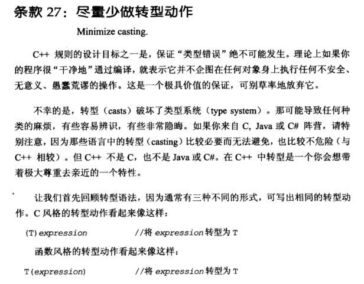
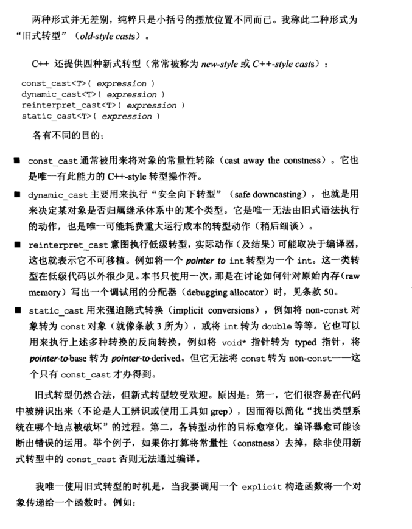
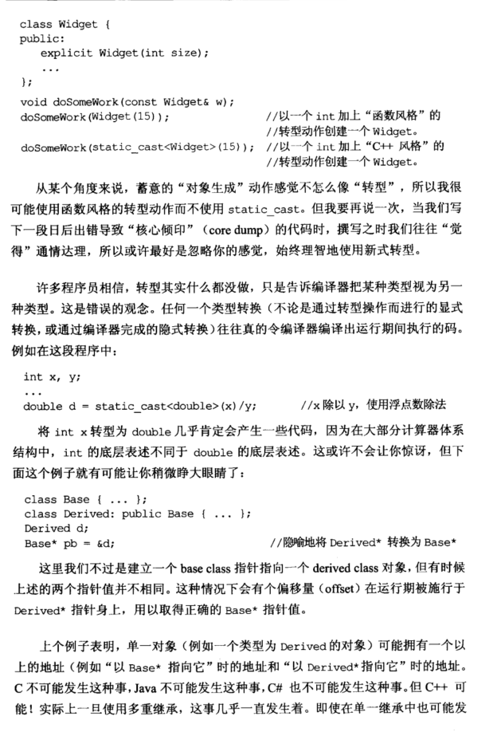
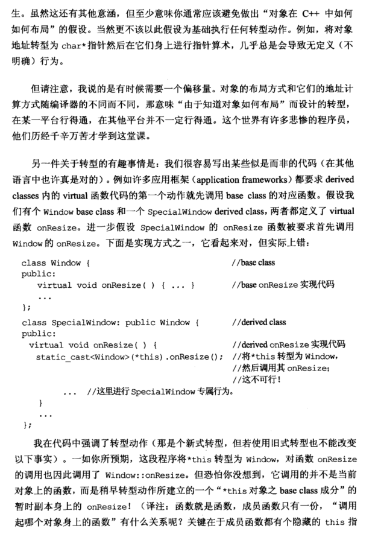
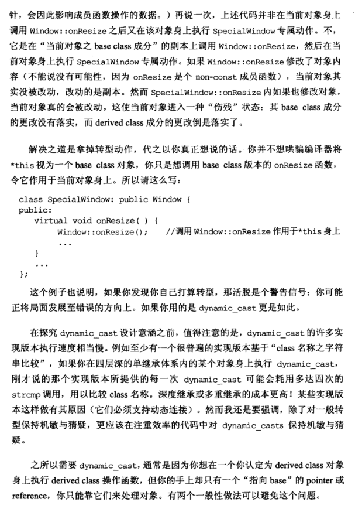
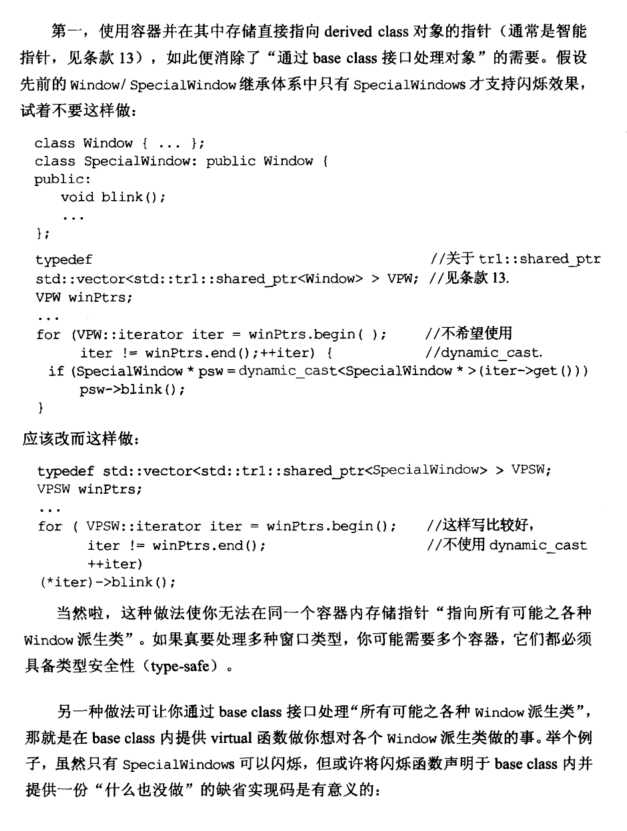
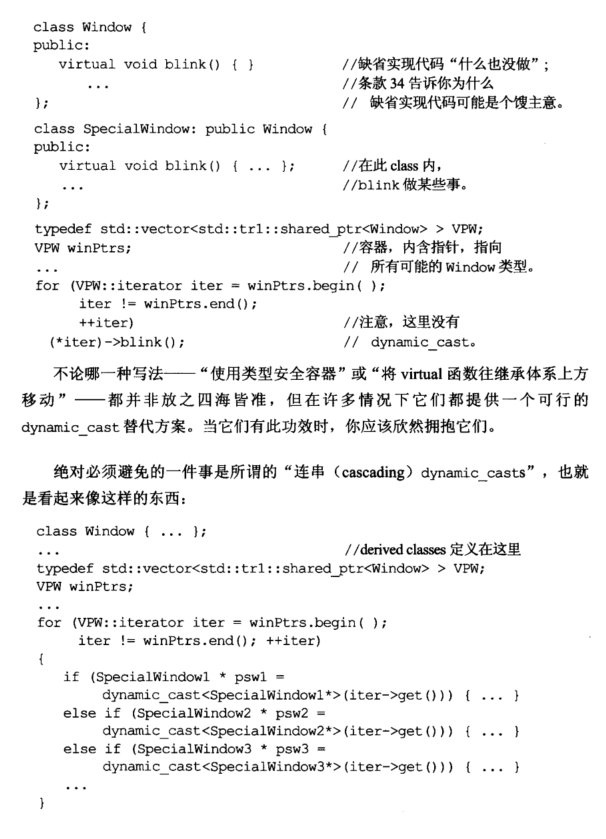
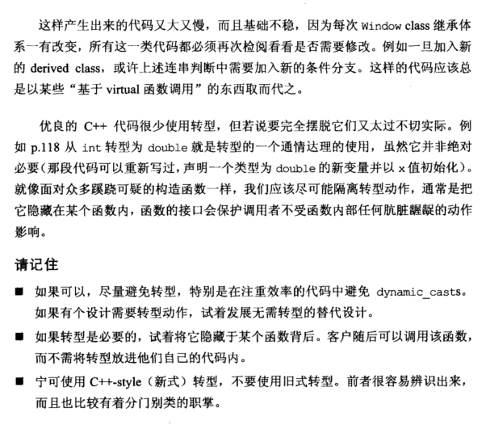

# Note

# other1

### 条款 27：尽量少做转型动作

- c++ 提供了 4 种新式的转型：
  - `const_cast<T>(expression)`：用来将对象的常量性移除。
  - `dynamic_cast<T>(expression)`：安全向下转型。
  - `reinterpret_cast<T>(expression)`：用来处理无关类型之间的转换。具体实现于与编译器有关，不具备移植性。
  - `static_cast<T>(expression)`：强迫隐式转换，类似 c 中的强转。

- 目前旧式转型依然合法，但是新式的转型更具有优势：
  - 新式转型可以很容易在代码中辨识出来，便于搜索和阅读。
  - 各转型动作的目标越细化，编译器就越可能帮助诊断错误运用。

- 函数型转型: `doSomeWork(const YourClass&);` 原型存在以下使用 `doSomeWork(YourClass(15)) == doSomeWork(static_cast<YourClass>(15))`，这两种情况是等效的。

- 有时当我们持有一个函数指针时，不要妄想通过知道对象内存布局来进行偏移实现某些操作，这对于不同编译器不同平台时不可移植的。

- 下边这种操作时错误的，它仅仅时作用在了强转产生的一个针对 this 指针父类资源的副本上。

```cpp
class Window { // base class

public:
    virtual void onResize() {... } // base onResize impl
    ...
};

class SpecialWindow : public Window { // derived class

public:
    virtual void onResize()
    {                                           // derived onResize impl;

        static_cast<Window>(*this).onResize();  // cast *this to Window,
                                                // then call its onResize;
                                                // this doesn't work!
        ...                                     // do SpecialWindow-
    }                                           // specific stuff
    ...
};
```

- dynamic_cast 转换慎用，**大部分的实现效率低下**（通过对 class 名称进行比对）。一般使用的情况都是在你想要将一个退化为基类的派生类指针，转换为派生类。

# other2

# 条款27：尽量少做转型操作

C++规则的设计目标之一是，保证类型错误绝不可能发生。理论上如果你的程序很干净地通过编译，就表示它并不企图在任何对象身上执行任何不安全、无意义、愚蠢荒谬的操作。

然而转型破坏了类型系统。那可能导致某些麻烦，有些容易辨识，有些非常隐晦。

C++提供了四种新式转型：

```cpp
const_cast<T>(expr)
dynamic_cast<T>(expr)
reinterpret_cast<T>(expr)
static_cast<T>(expr)
```

新式转型在代码中的可读性更强，推荐使用。唯一使用旧式类型转换的场景是将一个对象传给explicit构造函数时：

```cpp
class Widget {
public:
  explicit Widget(int size);
  ...
};
void doSomeWork(const Widget& w);
doSomeWork(Widget(15));               // C style
doSomeWork(static_cast<Widget>(15));  // C++ style 
```

蓄意的对象生成动作感觉不怎么像转型，所以我很可能使用函数风格的转型而不使用 `static_cast`。

我们很容易写出某些似是而非的代码。例如许多应用框架都要求派生类内的虚函数代码的第一个操作就先调用基类的对应函数。假设我们有个Window基类和一个和一个SpecialWindow派生类，两者都定义了虚函数onResize。进一步假设SpecialWindow和Window的onResize函数被要求首先调用Window的onResize。下面是实现方式之一，实际上是错误的：

```cpp
class Window {
public:
  virtual void onResize() {...}
  ...
};
class SpecialWindow: public Window {
public:
  virtual void onResize() {
    static_cast<Window>(*this).onResize(); // error
    ...
  }
  ...
};
```

它调用的不是当前对象的函数。它是在当前对象的基类副本上调用 `Window::onResize`，然后在当前对象上执行SpecialWindow的操作。这会导致其base成分的修改没有落实，而派生类成分已经修改了。

解决方法是拿掉转型动作：

```cpp
class SpecialWindow: public Window {
public:
  virtual void onResize() {
    Window::onResize(); // ok
    ...
  }
  ...
};
```

在探究 `dynamic_cast` 的设计意图之前，值得注意的是，它的许多实现版本执行速度相当慢。在一个四层深的单继承体系内的某个对象身上执行dynamic_cast，某个实现版本可能会执行多达4次的strcmp调用用以比较类名的字符串。记住在注重效率的代码中对dynamic_cast保持警惕。

之所以需要dynamic_cast，通常是因为你想在一个你认定为派生类对象上执行派生类函数，但你手上只有一个指向基类的指针或引用，你只能靠它们来处理对象。有两个一般性的做法可以避免这个问题。

第一，使用容器并在其中存储直接指向派生类对象的指针，如此便消除了通过基类接口处理对象的需要。假设先前的Window/SpecialWindow继承体系中只有SpecialWindow才支持闪烁效果，试着不要这样做：

```cpp
class Window {...};
class SpecialWindow : public Window {
public:
  void blink();
  ...
};
typedef std::vector<std::shared_ptr<Window>> VPW;
VPW winPtr;
...
for (VPW::iterator iter = winPtr.begin();
     iter != winPtr.end(); ++iter) {
  if (SpecialWindow* psw = dynamic_cast<SpecialWindow*>(iter->get())) {
    psw->blink();
  }
}
```

应该改成这样做：

```cpp
typedef std::vector<std::shared_ptr<SpecialWindow>> VPSW;
VPSW winPtr;
...
for (VPSW::iterator iter = winPtr.begin();
     iter != winPtr.end(); ++iter) {
    (*iter)->blink();
}
```

如果要处理多种窗口类型，你肯恶搞需要多个容器，它们都必须具备类型安全性。

另一种做法可让你通过基类的接口处理所有可能的各种Window派生类，那就是在基类内提供虚函数做你相对各个Window派生类做的事。举个例子，将闪烁函数声明于基类内并提供一份空代码是有意义的：

```cpp
class Window {
public:
  virtual void blink() {}
  ...
};
class SpecialWindow : public Window {
  virtual void blink() {...}
  ...
};
typedef std::vector<std::shared_ptr<Window>> VPW;
VPW winPtr;
...
for (VPW::iterator iter = winPtr.begin();
     iter != winPtr.end(); ++iter) {
  (*iter)->blink();
}
```

不论哪一种写法，使用类型安全容器或将虚函数往继承体系上方移动，在许多情况下它们都提供一个可行的dynamic_cast替代方案。

优秀的C++代码很少使用转型，但要说完全摆脱它们不太实际。我们应该尽可能避免转型操作，通常是把它隐藏在某个函数内。

> **请记住**
>
> - 如果可以，尽量避免转型，特别是在注重效率的代码中避免dynamic_cast。如果有个设计需要转型动作，试着发展无需转型的替代设计。
> - 如果转型是有必要的，试着将它隐藏于某个函数背后。客户随后可以调用该函数，而不需要将转型放进他们自己的代码内。
> - 宁可使用C++ style转型，不要使用旧式转型。前者很容易辨识出来，而且也比较有着分门别类的职掌。


# other3

**27. 尽量不要进行强制类型转换  （Minimize casting)**

主要是因为：

1.从int转向double容易出现精度错误

2.将一个类转换成他的父类也容易出现问题

总结：

+ 尽量避免转型，特别是在注重效率的代码中避免dynamic_cast，试着用无需转型的替代设计
+ 如果转型是必要的，试着将他封装到韩束背后，让用户调用该函数，而不需要在自己的代码里面转型
+ 如果需要转型，使用新式的static_cast等转型，比原来的（int）好很多（更明显，分工更精确）

# Book















