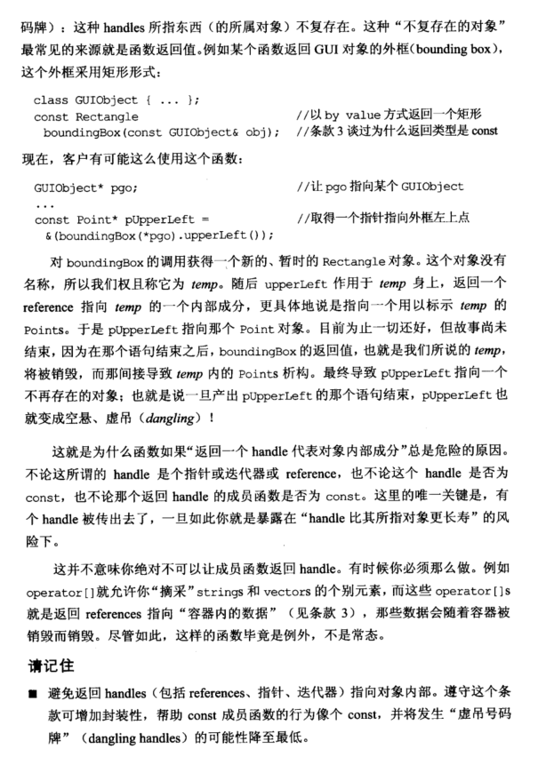

# Note

# other1

# 条款28：避免返回handles执行对象内部成分

假设你的程序涉及矩形。每个矩形由其左上角和右下角表示。为了让一个Rectangle对象尽可能小，你可能会决定不把定义矩形的这些点存放在Rectangle对象内，而是放在一个辅助的struct内再让Rectangle指向它：

```cpp
class Point {
public:
  Point(int x, int y);
  ...
  void setX(int newVal);
  void setY(int newVal);
  ...
};
struct RectData {
  Point upperLeftCorner;
  Point lowerRightCorner;
};
class Rectangle {
public:
  Point& upperLeft() const { return pData->upperLeftCorner; }
  Point& lowerRight() const { return pData->lowerRightCorner; }
  ...
private:
  std::shared_ptr<RectData> pData;
};
```

这样设计可通过编译，但却是错误的。它是自我矛盾的，一方面upperLeft和lowerRight被声明为const成员，另一方面其返回一个引用指向内部private成员，调用者可通过引用更改数据！例如：

```cpp
Point coord1(0, 0);
Point coord2(100, 100);
const Rectangle rec(coord1, coord2);
rec.upperLeft().setX(50); // (0, 0) => (50, 0)
```

由于成员函数返回成员变量的引用，或指针和迭代器，会导致对象的封装性被破坏。引用、指针和迭代器都是所谓的handles（句柄，用来获得某个对象），而返回一个对象内部数据的handle，会导致对象封装性被破坏，也可能导致const成员函数失去const语义。

通常我们认为，对象的内部就是指它的成员变量，但其实不被公开使用的成员函数也是对象内部的一部分。因此也应该留心不要返回它们的handles。这意味着你绝不该令该成员函数返回一个指针指向访问级别较低的成员函数。

我们可以对它们的返回类型加上const：

```cpp
class Rectangle {
public:
  const Point& upperLeft() const { return pData->upperLeftCorner; }
  const Point& lowerRight() const { return pData->lowerRightCorner; }
  ...
};
```

这样，矩形的Point成为只读数据。

但即使如此，upperLeft和upperRight有可能再其他场合带来问题，它可能导致指针空悬。这种不存在的对象最常见的来源就是函数返回值。例如某个函数返回GUI对象的外框，这个外框采用矩形形式：

```cpp
class GUIObject {...};
const Rectangle boundingBox(const GUIObject& obj);
```

客户有可能这么使用这个函数：

```cpp
GUIObject* pgo;
...
const Point* pUpperLeft = &(boundingBox(*pgo).upperLeft());
```

对boundingBox的调用会获得一个临时对象，它在语句结束后会被销毁，pUpperLeft就指向一个不存在的对象，造成指针空悬。

这并不意味着你绝不可以让成员返回handle。有时候你必须那么做。如 `operator[]` 允许你获取string和vector的元素，`operator[]` 返回的就是指向内部数据的引用。那些数据会随着容器被销毁而销毁。尽管如此，这是个例外，不是常态。

> **请记住**
>
> - 避免返回handles（包括引用、指针、迭代器）指向对象内部。遵守这个条款可增加封装性，帮助const成员函数的行为像个const，并将发生空handle的可能性降到最低。

# other2

### 条款 28：避免返回 handles 指向对象内部成分

- 通常我们认为对象”内部“就是指它的成员变量，不对外公开的数据、使用的函数，因此当返回 handle 指向了这部分则会导致类的封装遭到破坏。

- 类方法返回`引用的方式`向外暴露对象内部成员时：
  - 首先会导致类成员的封装性降低，类成员的封装性最多只等于这个类方法的访问级别。
  - 并且当返回非 const 的引用，并且这个引用对象指向类成员时，调用者就可以直接修改掉对象类成员，而不用通过任何方法，导致封装被破坏。解决这个的问题则是将返回的类型限定为 const，避免使用者修改的危险。`相当于有限的放松了类成员的读权限`。

- 当返回指针、迭代器与引用存在的问题是一致的，破坏了类的封装性。

- 除了破坏类的封装性问题，返回 handle 指向类内部成分还存在更严重的问题即，空悬(dangling)。因此当使用指向类内部的 handle 时，必须注意对象的生命周期。

# other3

**28. 避免返回handles指向对象内部成分  （Avoid returning "handles" to object internals)**

主要是为了防止用户误操作返回的值：
    

```cpp
修改前代码：
class Rectangle{
    public:
    Point& upperLeft() const { return pData->ulhc; }
    Point& lowerRight() const { return pData->lrhc; }
}
如果修改成：
class Rectangle{
    public:
    const Point& upperLeft() const { return pData->ulhc; }
    const Point& lowerRight() const { return pData->lrhc; }
}
则仍然会出现悬吊的变量，例如：
const Point* pUpperLeft = &(boundingBox(*pgo).upperLeft());
```

boundingBox会返回一个temp的新的，暂时的Rectangle对象，在这一整行语句执行完以后，temp就变成空的了，就成了悬吊的变量

总结：

+ 尽量不要返回指向private变量的指针引用等
+ 如果真的要用，尽量使用const进行限制，同时尽量避免悬吊的可能性

# Book





