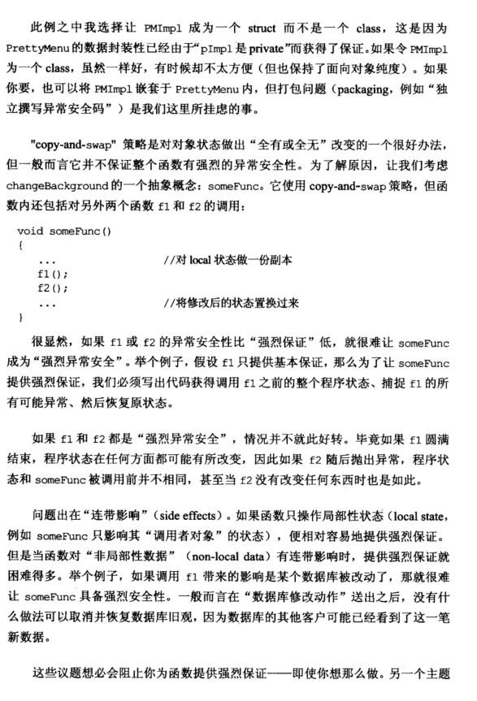

# Note

# other1

**29. 为“异常安全”而努力是值得的  （Strive for exception-safe code)**

异常安全函数具有以下三个特征之一：

+ 如果异常被抛出，程序内的任何事物仍然保持在有效状态下，没有任何对象或者数据结构被损坏，前后一致。在任何情况下都不泄露资源，在任何情况下都不允许破坏数据，一个比较典型的反例：

+ 如果异常被抛出，则程序的状态不被改变，程序会回到调用函数前的状态

+ 承诺绝不抛出异常

  原函数：
  class PrettyMenu{
      public:
      void changeBackground(std::istream& imgSrc); //改变背景图像
      private:
      Mutex mutex; // 互斥器
  };

  void changeBackground(std::istream& imgSrc){
      lock(&mutex);               //取得互斥器
      delete bgImage;             //摆脱旧的背景图像
      ++imageChanges;             //修改图像的变更次数
      bgImage = new Image(imgSrc);//安装新的背景图像
      unlock(&mutex);             //释放互斥器
  }
  当异常抛出的时候，这个函数就存在很大的问题：

+ 不泄露任何资源：当new Image(imgSrc)发生异常的时候，对unlock的调用就绝不会执行，于是互斥器就永远被把持住了

+ 不允许数据破坏：如果new Image(imgSrc)发生异常，bgImage就是空的，而且imageChanges也已经加上了

  修改后代码：
  void PrettyMenu::changeBackground(std::istream& imgSrc){
      Lock ml(&mutex);    //Lock是第13条中提到的用对象管理资源的类
      bgImage.reset(new Image(imgSrc));
      ++imageChanges; //放在后面
  }

总结：

+ 异常安全函数的三个特征
+ 第二个特征往往能够通过copy-and-swap实现出来，但是并非对所有函数都可实现或具备现实意义
+ 函数提供的异常安全保证，通常最高只等于其所调用各个函数的“异常安全保证”中最弱的那个。即函数的异常安全保证具有连带性

# other2

### 条款 29：为“异常安全”而努力是值得的

- 异常安全性即当有异常抛出时，函数会保证：
  - 不泄露任何资源；
  - 不允许数据被破坏：即已经被修改的成员或者状态当异常发生后，需要保证恢复到调用之前的状态。

- 异常安全函数提供以下三个保证之一：
  - 基本承诺：如果异常抛出，程序内的任何事物仍然保持在有效的状态下。但是当调用失败后无法确保当前函数处于哪种状态。
  - 强烈保证：如果异常抛出，程序的状态不会改变，即如果函数调用成功就是完全成功，失败就会回退到调用前的状态。
  - 不抛掷异常：承诺不抛出异常，能供完成承诺的功能。

- 实现强烈保证的异常安全：
  - 将堆内存资源、锁资源等等，通过智能指针以及资源管理类进行管理。
  - `不要为了标识某件事情发生而改变对象状态，除非那件事情真的发生了`。
    - 只有当已经具体事情执行完成后才进行修改标志事情的内部状态（计数器、标志位等等）相应操作。

- copy and swap 策略：对打算修改的对象进行拷贝，在其副本上进行修改，当所有操作成功后，再将修改的副本与元对象在一个不抛出异常的操作中进行置换（swap）。

```cpp
struct PMImpl {                         // PMImpl = "PrettyMenu

    std::tr1::shared_ptr<Image> bgImage; // Impl."; see below for

    int imageChanges;                   // why it's a struct  p132解释
};

class PrettyMenu {

    ····

private:
    Mutex mutex;

    std::tr1::shared_ptr<PMImpl> pImpl;
};

void PrettyMenu::changeBackground(std::istream& imgSrc)
{

    using std::swap;                        // see Item 25

    Lock ml(&mutex);                        // acquire the mutex

    std::tr1::shared_ptr<PMImpl>            // copy obj. data

        pNew(new PMImpl(*pImpl));

    pNew->bgImage.reset(new Image(imgSrc)); // modify the copy

    ++pNew->imageChanges;

    swap(pImpl, pNew);                      // swap the new

                                            // data into place

}                                           // release the mutex
```

- copy and swap 虽然对于对象状态的回退是个好办法，但是它并不能保证整个函数，尤其当函数内部调用了其他函数方法，那么就变成了木桶效应，整个函数的异常安全级别由最低的那个函数决定。

- 保证异常安全对于效率上的影响也是需要考虑的，有时刻意的提供强烈保证的异常安全导致的效率与复杂度对于其他人也是灾难的，因此效率、复杂度与将要提供的安全等级之间需要寻求平衡。

# other3

# 条款29：为“异常安全”而努力是值得的

假设有个class用来表现夹带背景图案的GUI菜单。这个class希望用于多线程环境，所以它有个互斥体作为并发控制之用：

```cpp
class PrettyMenu {
public:
  ...
  void changeBackground(std::istream& imgSrc);
  ...
private:
  Mutex mutex;
  Image* bgImage;
  int imageChanges;
};
```

下面是PrettyMenu的changeBackground函数的一个可能实现：

```cpp
void PrettyMenu::changeBackground(std::istream& imgSrc) {
  lock(&mutex);
  delete bgImage;
  ++imageChanges;
  bgImage = new Image(imgSrc);
  unlock(&mutex);
}
```

从异常安全性来看，这个函数很糟。异常安全有两个条件，而这个函数没有满足其中任何一个条件。

当异常抛出时，异常安全的函数会：

- **不泄露任何资源。** 上述代码没有做到这一点，一旦 `new Image(imgSrc)` 导致异常，对unlock的调用就绝不会指向，于是互斥体永远锁住了。
- **不允许数据破坏。** 如果 `new Image(imgSrc)` 抛出异常，bgImage就指向一个已经被删除的对象，imageChanges也已被累加，而其实没有新的图形被成功安放。

解决资源泄露的问题很容易，条款13讨论过如何以对象管理资源，条款14导入了Lock类作为一种确保互斥体被即使释放的方法：

```cpp
void PrettyMenu::changeBackground(std::istream& imgSrc) {
  Lock ml(&mutex);
  delete bgImage;
  ++imageChanges;
  bgImage = new Image(imgSrc);
}
```

资源泄露问题解决了，现在我们可以专注于解决数据破坏了。

异常安全函数提供以下三个保证之一：

- **基本承诺**：如果异常被抛出，程序内的任何事物仍然保持在有效状态下。没有任何对象或数据结构会因此被破坏，所有对象都处于内部前后一致的状态。
- **强烈保证**：如果异常被抛出，程序状态不改变。调用这样的函数需要有这样的认识：如果函数成功，就完全成功，如果函数失败，程序会恢复到调用函数前的状态。
- **不抛异常保证**：承诺绝不抛出异常，因为它们总是能够完成它们原先承诺的功能。作用于内置类型身上的所有操作都提供不抛异常保证。如果真的出现异常，程序会终止运行。

对于changeBackground而言，提供强烈保证几乎不困难。首先将 `Image*` 的原始指针改为一个资源管理的智能指针，然后重新排列函数内的语句顺序，使得在更换图像之后才累加imageChanges。

```cpp
class PrettyMenu {
  ...
  std::shared_ptr<Image> bgImage;
  ...
};
void PrettyMenu::changeBackground(std::istream& imgSrc) {
  Lock ml(&mutex);
  bgImage.reset(new Image(imgSrc));
  ++imageChanges;
}
```

现在，changeBackground提供了强烈的异常安全保证。美中不足的是参数imgSrc。如果Image构造函数抛出异常，有可能输入流的读取记号被一走，changeBackground在解决这个问题之前只提供基本的异常安全保证。

有个一般化的涉及策略很典型地会导致强烈保证，这个策略被称为copy and swap。原则很简单：为你打算修改的对象做一份副本，然后在副本上做出一切必要修改。若有任何修改操作抛出异常，源对象保持未改变状态。所有改变成功后，再将修改过的副本和源对象在一个不抛异常的swap函数完成置换。

实现上通常是将所有隶属对象的数据从原对象放入另一个对象内，然后赋予原对象一个指针，指向那个实现对象。这种手法通常称为pimpl idiom。对PrettyMenu而言，典型写法入下：

```cpp
struct PMImpl {
  std::shared_ptr<Image> bgImage;
  int imageChanges;
};
class PrettyMenu {
  ...
private:
  Mutex mutex;
  std::shared_ptr<PMImpl> pImpl;
};
void PrettyMenu::changeBackground(std::istream& imgSrc) {
  using std::swap;
  Lock ml(&mutex);
  std::shared_ptr<PMImpl> pNew(new PMImpl(*pImpl));
  pNew->bgImage.reset(new Image(imgSrc)); 
  ++pNew->imageChanges;
  swap(pImpl, pNew);
}
```

此例中PMImpl称为一个struct而不是一个class，因为PrettyMenu的数据封装性已经由pImpl是private得到了保证。

copy and swap策略是实现“全有或全无”的一个很好办法，但一般而言它并不保证整个函数有强烈的异常安全性。让我们考虑下面这个例子：

```cpp
void someFunc {
  ...
  f1();
  f2();
  ...
}
```

如果f1或f2的异常安全性比强烈保证低，就很难让someFunc称为强烈异常安全。如果f1和f2都是强烈异常安全，情况未必好转。假设f1成功执行，程序状态发生改变，而f2执行失败，恢复到执行前的状态，但此状态和someFunc调用前并不相同。

> **请记住**
>
> - 异常安全函数即使发生异常也不会资源泄露或允许任何数据结构破坏。这样的函数区分为三种可能的保证：基本型、强烈型、不抛异常型。
> - 强烈保证往往能够以copy and swap实现出来，但强烈保证并非对所有函数都有可实现或具备现实意义。
> - 函数提供的异常安全保证通常最高只等于其所调用的各个函数的异常安全保证中的最低者。

# Book





